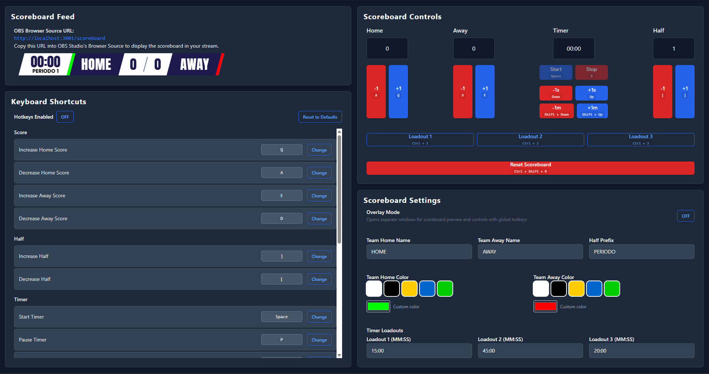
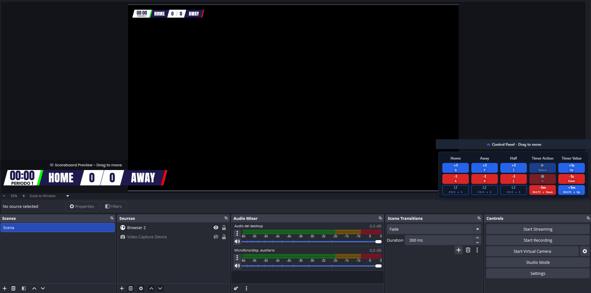

# Scoreboard Server

<div align="center">

A professional real-time scoreboard application for live streaming and sports broadcasting, built with Electron, React, and TypeScript.

[](LICENSE)
[](package.json)

</div>

---

## 📋 Table of Contents

- [Features](#-features)
- [Screenshots](#-screenshots)
- [Installation](#-installation)
- [Usage](#-usage)
- [Overlay Mode](#-overlay-mode)
- [Hotkey Configuration](#-hotkey-configuration)
- [OBS Studio Integration](#-obs-studio-integration)
- [Development](#-development)
- [Building](#-building)
- [Tech Stack](#-tech-stack)
- [License](#-license)

---

## ✨ Features

### Core Functionality
- **Real-time Score Management** - Control home and away team scores with instant updates
- **Game Timer** - Countdown timer with play, pause, and stop controls
- **Half/Period Tracking** - Track game periods or halves with customizable labels
- **Customizable Teams** - Configure team names and brand colors
- **Timer Loadouts** - Quick-access presets for common timer durations (e.g., 15:00, 45:00, 20:00)

### Advanced Features
- **Overlay Mode** - Separate windows for controls and preview, perfect for multi-monitor setups
- **Global Hotkeys** - Control everything without focusing the app window
- **Browser Source Support** - Seamless integration with OBS Studio and streaming software
- **WebSocket Server** - Real-time updates to all connected clients

### Customization
- **Team Colors** - Visual color picker for team branding
- **Custom Labels** - Rename teams and period/half prefixes
- **Flexible Hotkeys** - Fully customizable keyboard shortcuts with duplicate detection
- **Responsive Design** - Clean, modern UI that scales beautifully

---

## 📸 Screenshots

### Main Application View


### Example Usage with OBS Studio


<details>
<summary><strong>Disclaimer about OBS Studio in screenshots</strong></summary>

The OBS Studio interface shown in the screenshot is for demonstration purposes only. Scoreboard Server does not include, modify, or distribute any OBS Studio code or assets. The OBS Studio view is used solely to illustrate how Scoreboard Server can be integrated as a browser source in streaming setups. All rights to OBS Studio belong to their respective owners.
</details>

---

## 📦 Installation

### Prerequisites
- **Node.js** 18+ and **pnpm** package manager
- **Windows**, **macOS**, or **Linux**

### Quick Start

1. **Clone the repository**
   ```bash
   git clone https://github.com/d-luca/scoreboard_server.git
   cd scoreboard_server
   ```

2. **Install dependencies**
   ```bash
   pnpm install
   ```

3. **Run the application**
   ```bash
   pnpm dev
   ```

---

## 🎯 Usage

### Main Application

When you launch Scoreboard Server, you'll see the main control interface with two sections:

#### Scoreboard Controls
- **Team Scores**: Use +/- buttons to adjust home and away scores
- **Timer**: Start, pause, stop, and manually adjust the game timer
- **Half/Period**: Track game periods with increment/decrement controls
- **Timer Loadouts**: Quickly set common timer values (configurable in settings)
- **Reset**: Clear all scores and timer data

#### Scoreboard Settings
- **Overlay Mode**: Enable separate preview and control windows
- **Team Names**: Customize home and away team names
- **Team Colors**: Select brand colors for visual representation
- **Half Prefix**: Change the period label (e.g., "PERIOD", "HALF", "QUARTER")
- **Timer Loadouts**: Configure three preset timer durations for play/pause time or whatever you need

### Scoreboard Feedback
View your scoreboard design in real-time with the integrated preview. The scoreboard displays:
- Team names with colored indicators
- Current scores
- Game timer (countdown format)
- Current half/period

---

## 🖥️ Overlay Mode

Overlay Mode is designed for streamers and broadcasters who need dedicated control and preview windows:

### Activating Overlay Mode

1. Navigate to **Scoreboard Settings**
2. Toggle **Overlay Mode** to **ON**
3. Two new windows will appear:
   - **Overlay Preview**: Shows the scoreboard display (for reference)
   - **Overlay Controls**: Compact control panel with all functions

### Overlay Controls Window
The compact control panel features:
- **5-Column Layout**: Home, Away, Half, Timer Actions, Timer Values
- **Visual Hotkey Indicators**: Each button shows its assigned hotkey
- **Quick Access**: All controls accessible without switching windows
- **Always on Top**: Stays visible while working in other applications

### Benefits
- Control scoreboard from any window with global hotkeys
- Keep preview visible while streaming
- Compact interface perfect for small screens
- Independent window positioning

### Disclaimer
When in overlay mode, if the hotkeys are enabled, they will be globally registered, this mean that they will work even when you are not focusing the main app or the overlay

---

## ⌨️ Hotkey Configuration

Scoreboard Server includes fully customizable global hotkeys that work even when the app is in the background.

### Default Hotkeys

#### Score Control
- **Increase Home Score**: `W`
- **Decrease Home Score**: `Q`
- **Increase Away Score**: `E`
- **Decrease Away Score**: `D`

#### Timer Control
- **Start Timer**: `Space`
- **Pause Timer**: `P`
- **Stop Timer**: `S`
- **+1 Second**: `↑` (Up Arrow)
- **-1 Second**: `↓` (Down Arrow)
- **+1 Minute**: `Shift + ↑`
- **-1 Minute**: `Shift + ↓`

#### Timer Loadouts
- **Loadout 1**: `Ctrl + 1`
- **Loadout 2**: `Ctrl + 2`
- **Loadout 3**: `Ctrl + 3`

#### Half/Period
- **Increase Half**: `]`
- **Decrease Half**: `[`

#### Other
- **Reset Scoreboard**: `Ctrl + Shift + R`

### Customizing Hotkeys

1. Click the **Hotkey Settings** button in the main window
2. Browse hotkeys organized by category (Score, Timer, Half, Loadouts, Other)
3. Click **Change** next to any hotkey
4. Press your desired key combination
5. The app will warn you if the key is already assigned
6. Click **Reset to Defaults** to restore original hotkeys
7. Toggle **Enable Hotkeys** to temporarily disable all shortcuts

### Hotkey Features
- **Modifier Support**: Combine with Ctrl, Alt, and Shift
- **Conflict Detection**: Automatic duplicate detection
- **Visual Feedback**: Hotkey badges on all buttons

---

## 📡 OBS Studio Integration

### Adding the Scoreboard to OBS

1. **Start Scoreboard Server**
2. In OBS Studio, add a new **Browser Source**
3. Configure the source:
   - **URL**: `http://localhost:3001/scoreboard`
   - **Width and Height**: The scoreboard is define to fill the entire space available, therefore you can adjust its dimension directly from the OBS Scene component
   - ✅ Check **Shutdown source when not visible**
   - ✅ Check **Refresh browser when scene becomes active**

4. Position and resize the source in your scene
5. Control the scoreboard from the app while streaming

### Tips for Streaming
- The scoreboard updates in real-time via WebSocket
- Use **Overlay Mode** for better workflow during streams
- Use hotkeys to control the scoreboard without switching windows
- The scoreboard has a transparent background for easy integration

---

## 🛠️ Development

### Recommended IDE Setup

- [Visual Studio Code](https://code.visualstudio.com/)
- [ESLint Extension](https://marketplace.visualstudio.com/items?itemName=dbaeumer.vscode-eslint)
- [Prettier Extension](https://marketplace.visualstudio.com/items?itemName=esbenp.prettier-vscode)

### Available Scripts

```bash
# Start development mode
pnpm dev

# Start with scoreboard build watching
pnpm dev:with-scoreboard

# Run type checking
pnpm typecheck

# Lint code
pnpm lint

# Format code
pnpm format

# Build scoreboard only
pnpm build:scoreboard

# Start preview mode (after building)
pnpm start
```

### Project Structure

```
src/
├── main/           # Electron main process
│   ├── index.ts    # Main entry, window management, IPC
│   ├── server.ts   # Express + WebSocket server
│   └── ssr.ts      # Server-side rendering for scoreboard
├── preload/        # Preload scripts for IPC
├── renderer/       # React frontend
│   └── src/
│       ├── components/  # React components
│       ├── stores/      # Zustand state management
│       ├── hooks/       # Custom React hooks
│       └── pages/       # Page components
└── types/          # Shared TypeScript types
```

---

## 🏗️ Building

Build executables for distribution:

```bash
# Windows
pnpm build:win

# macOS
pnpm build:mac

# Linux
pnpm build:linux
```

The built applications will be in the `dist/` directory.

### Build Configuration

The build process uses `electron-builder`. Configuration is in `electron-builder.yml`:
- **Product Name**: Scoreboard Server
- **App ID**: `com.github.d-luca.scoreboard-server`
- Includes SSR scoreboard files
- Creates installers for each platform

---

## 🔧 Tech Stack

### Frontend
- **React 19** - UI framework
- **TypeScript** - Type-safe development
- **Tailwind CSS 4** - Utility-first styling
- **Zustand** - State management
- **Radix UI** - Accessible component primitives

### Backend
- **Electron 38** - Desktop application framework
- **Express 5** - HTTP server
- **WebSocket (ws)** - Real-time communication
- **Node.js** - Runtime environment

### Build Tools
- **Vite 7** - Fast bundler and dev server
- **electron-vite** - Electron integration
- **electron-builder** - Application packaging
- **ESLint + Prettier** - Code quality and formatting

---

## 📄 License

This project is licensed under the MIT License - see the [LICENSE](LICENSE) file for details.

---

## 👤 Author

**Luca Davi**

- GitHub: [@d-luca](https://github.com/d-luca)
- Project Link: [https://github.com/d-luca/scoreboard_server](https://github.com/d-luca/scoreboard_server)

---

## 🙏 Acknowledgments

- Built with [Electron](https://www.electronjs.org/)
- UI components from [Radix UI](https://www.radix-ui.com/)
- Styled with [Tailwind CSS](https://tailwindcss.com/)

---

<div align="center">

**Made with ❤️ for the emerging sports community**

If this project helps you, please consider giving it a ⭐️!

</div>
