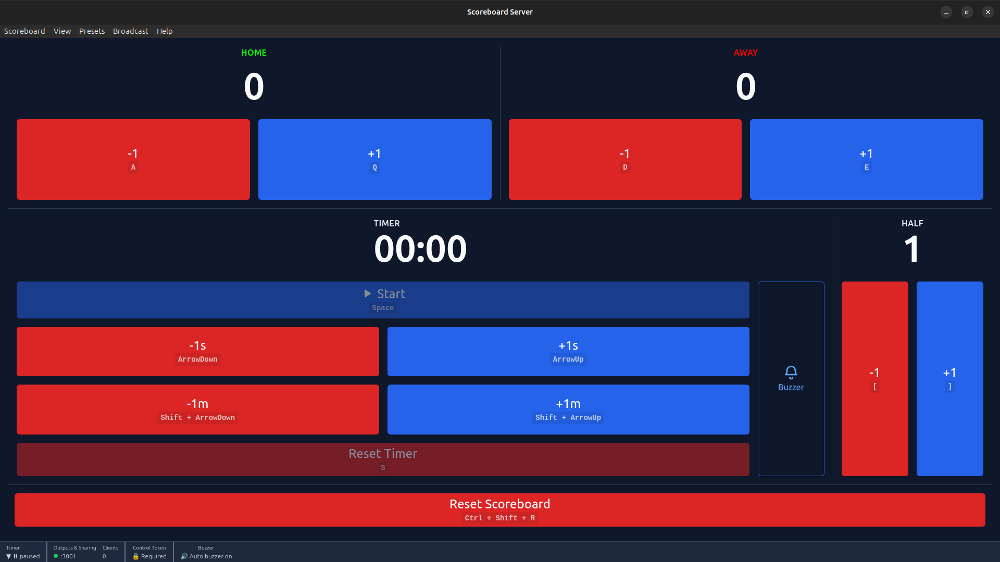
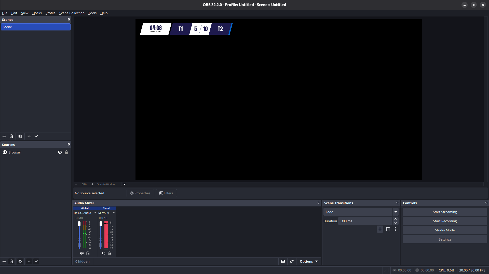
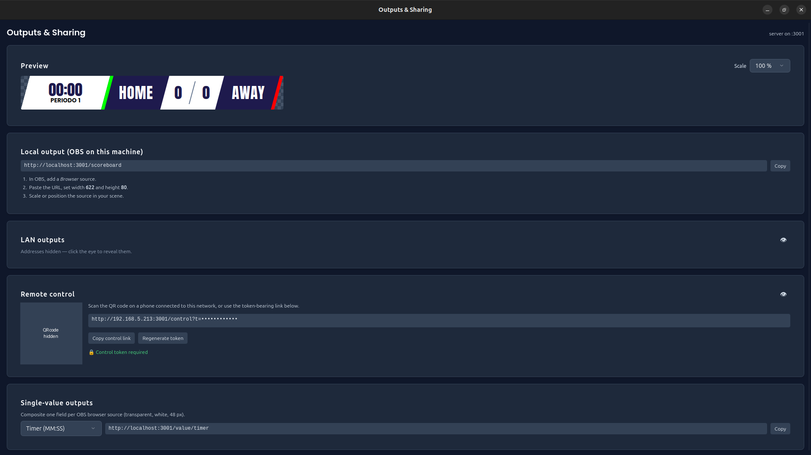
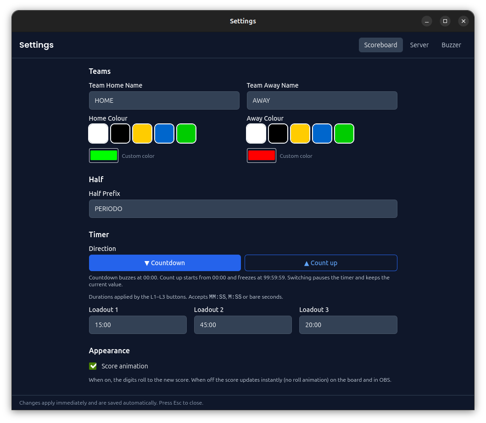
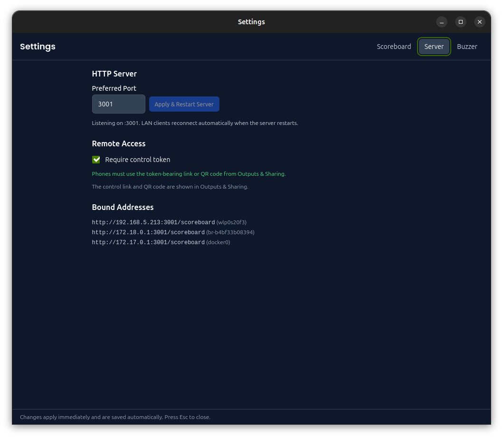
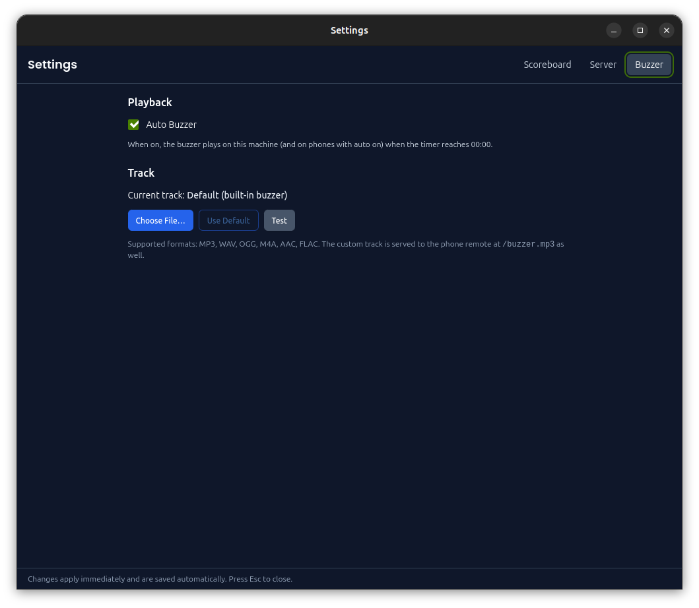
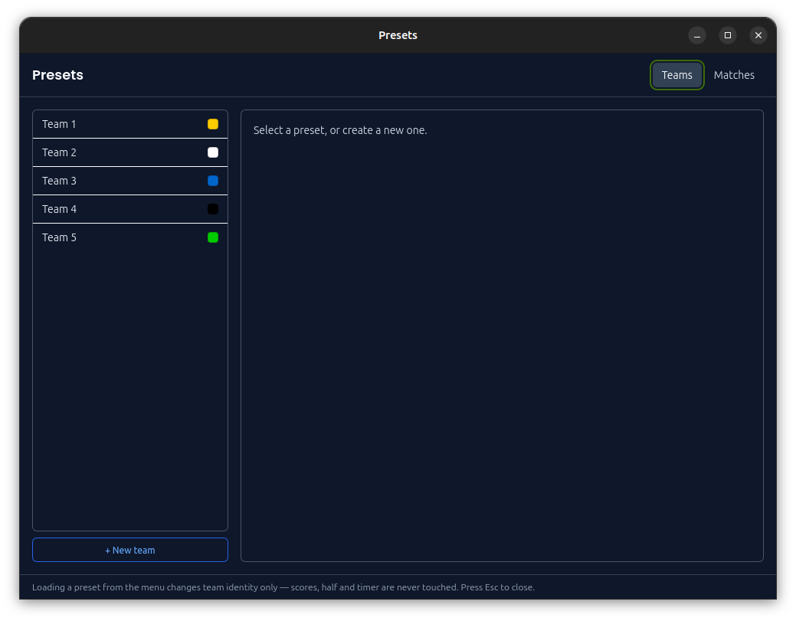
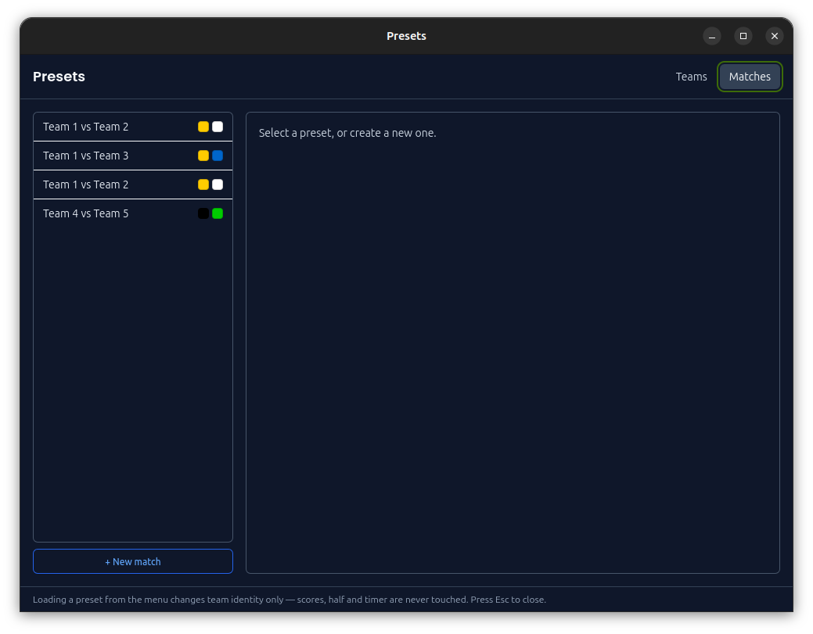
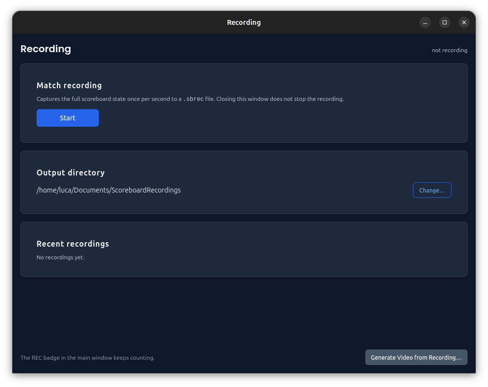
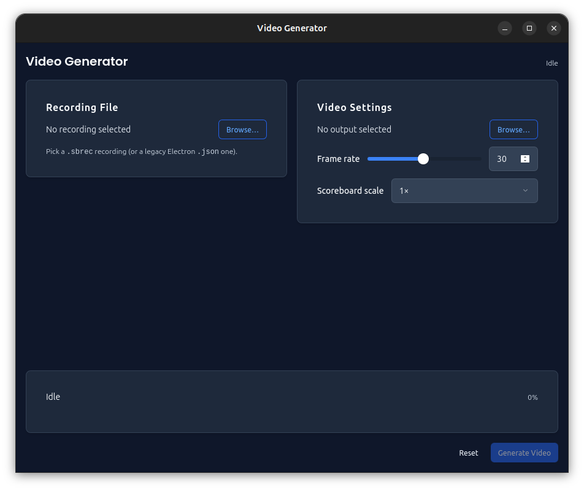

# Scoreboard Server

A desktop scoreboard for live sports streams. Manage scores and the game timer,
add a transparent scoreboard to OBS, and control the match from your phone.
No cloud, no account: everything stays on your local network.

Available for **Windows and Linux**.

[Download the latest release](../../releases/latest) ·
[Quick start](#quick-start) · [Screenshots](#screenshots) ·
[Developer docs](docs/README.md)

## Features

- **Match controls**: update home and away scores, track halves or periods,
  and start, pause or stop the timer.
- **Flexible timer**: count down or up, save three timer durations for quick
  access, and sound a buzzer when the countdown reaches zero.
- **Your team's look**: customize team names, colours and period labels, with
  optional rolling score animations. Settings are remembered between sessions.
- **Team and match presets**: save teams and fixtures to set up the next match
  without entering everything again.
- **OBS integration**: a transparent scoreboard that updates live and reconnects
  automatically, plus individual values for custom layouts.
- **Phone remote**: scan a QR code to control the match from a phone or tablet
  on the same network. Access is protected by a token.
- **Recording and video**: save the scoreboard's progress during a match, then
  export it as a transparent video for your recordings or highlights.

## Screenshots

### Main application



### In OBS Studio



OBS Studio is shown for demonstration only and is not included with Scoreboard
Server. All rights to OBS Studio belong to their respective owners.

<details>
<summary>More screenshots: settings, presets, recording and sharing</summary>

### Outputs & Sharing



### Scoreboard settings



### Server settings



### Buzzer settings



### Team presets



### Match presets



### Match recording



### Video generator



</details>

## Install

Download an installer from the [latest release](../../releases/latest).
You do not need Node.js or Rust to use the packaged app.

### Windows

Run the `Scoreboard Server_x.y.z_x64-setup.exe` installer or the `.msi`.

- **SmartScreen**: the installer is not code-signed, so Windows may warn
  _"Windows protected your PC"_. If you downloaded it from this repository's
  releases, choose **More info → Run anyway** to continue.
- **Firewall**: on first launch, Windows Firewall asks for network access.
  Allow **Private networks** so phones and other computers on your LAN can
  connect.

### Linux

Download the `.AppImage` (portable, mark executable and run) or install the
`.deb` on Debian/Ubuntu:

```bash
sudo apt install ./scoreboard-server_x.y.z_amd64.deb
```

The AppImage requires the system WebKitGTK 4.1 runtime
(`libwebkit2gtk-4.1-0` on Debian/Ubuntu).

## Quick start

1. Launch **Scoreboard Server** and wait for the server badge in the status bar
   to turn green.
2. Open **Settings → Scoreboard** to set team names, colours, the period label
   and timer durations.
3. Open **Broadcast → Outputs & Sharing** and copy the scoreboard URL into an
   OBS Browser Source. Set its size to **600 × 80**.
4. Use the main window's score buttons, period controls and timer to run the
   match. OBS updates automatically.
5. To control the match from a phone, connect it to the same network and scan
   the QR code in **Outputs & Sharing**.

## Running a match

- **Scores and periods**: use `+` and `-` to adjust scores and the current half
  or period.
- **Timer**: start, pause or stop the clock. Choose a saved duration from the
  controls or **Presets → Timer 1/2/3**. Use reset to clear the match.
- **Count down or up**: choose the direction in **Settings → Scoreboard**.
  Countdown can sound the buzzer at `00:00`; count-up stops at `99:59:59`
  without a buzzer.
- **Appearance**: change team names, colours and the period label in Settings.
  Enable rolling scores under **Settings → Scoreboard → Appearance**.
- **Presets**: save teams and match setups in the **Presets** window and load
  them again for your next fixture.

## OBS setup

1. In OBS, add a **Browser Source**.
2. Paste the scoreboard URL from **Broadcast → Outputs & Sharing**:
   `http://<pc-ip>:<port>/scoreboard`.
3. Set width to **600** and height to **80**. The background is transparent.
4. Leave **Shutdown source when not visible** off to keep it connected between
   scenes. The page reconnects automatically if the connection drops.

`<pc-ip>` is the scoreboard PC's LAN address. `<port>` defaults to `3001` and
can be changed in **Settings → Server**. Always copy the exact URL from
**Outputs & Sharing**, which shows the port the server is actually using.

### Ticker / single-value sources

For a custom layout, use an individual value instead of the whole scoreboard:
`http://<pc-ip>:<port>/value/timer`. Other fields include `teamHomeScore`,
`teamAwayScore`, `half` and `teamHomeName`.

## Phone remote

1. Connect the phone to the same network as the scoreboard PC.
2. Open **Broadcast → Outputs & Sharing** and scan the QR code, or open the
   control link: `http://<pc-ip>:<port>/control?t=<token>`.
3. Use the remote's match controls. The desktop, phones and OBS stay in sync.

Treat the control link like a password: anyone with it on your network can
operate the scoreboard. Regenerate the token in **Outputs & Sharing** to
invalidate old links. Keep token protection enabled unless you trust everyone
on the network.

## Match recording & video

### Record the scoreboard

Open **Broadcast → Recording…** and start a recording. The app saves the
scoreboard state once per second, not your camera feed or audio.

- The **REC** badge in the main status bar shows that recording is active.
- Closing the recording window does **not** stop recording. Stop it from the
  recording controls when the match ends.
- Files are saved as `.sbrec` in `Documents/ScoreboardRecordings` by default;
  you can choose another folder in the recording window.
- Older `.json` recordings from the Electron app can still be opened.

### Export a transparent video

Open **Broadcast → Video Generator…**, or choose
**Generate Video from Recording…** in the recording window. Select a recording,
choose the frame rate and scoreboard scale, then generate the video.

The output is a transparent WebM that you can place over match footage in OBS
or a compatible video editor. Packaged releases include the video encoder.

## Troubleshooting

**OBS or the phone cannot connect.** Check that both devices are on the same
network, allow **Private networks** in Windows Firewall, and copy a fresh URL
from **Outputs & Sharing**.

**The port is not the configured one.** If the port set in **Settings → Server**
(default `3001`) is occupied, the app uses the next free port. The status bar
and **Outputs & Sharing** show the actual port.

**An old remote link no longer works.** Regenerating the access token invalidates
previous links. Scan the current QR code or copy the new control link.

**Need to reset settings?** Close the app and delete `settings.json` from its
config folder, then reopen it. This restores defaults:

- Windows: `%APPDATA%/dev.dluca.scoreboard-server`
- Linux: `~/.config/dev.dluca.scoreboard-server`

## Development

This branch uses **Tauri 2, Rust, React and TypeScript**. To run from source,
install Node.js 20+, pnpm 10, Rust stable and the
[platform prerequisites](docs/build-release.md#toolchain), then run:

```bash
pnpm install
pnpm dev
```

For video generation in development, install ffmpeg and make sure it is on
`PATH`.

- `pnpm check`: lint, type-check, build, clippy and Rust tests.
- `pnpm bindings`: regenerate TypeScript bindings from Rust types.
- `pnpm build`: produce installer bundles.

See the [developer documentation](docs/README.md) for architecture and feature
details, the [HTTP API and WebSocket reference](docs/protocol.md) for
integrations, and the [build and release guide](docs/build-release.md) for
packaging. Known development issues, including Linux WebKit errors and Windows
test failures, are covered in [troubleshooting](docs/pitfalls.md#development-troubleshooting).
