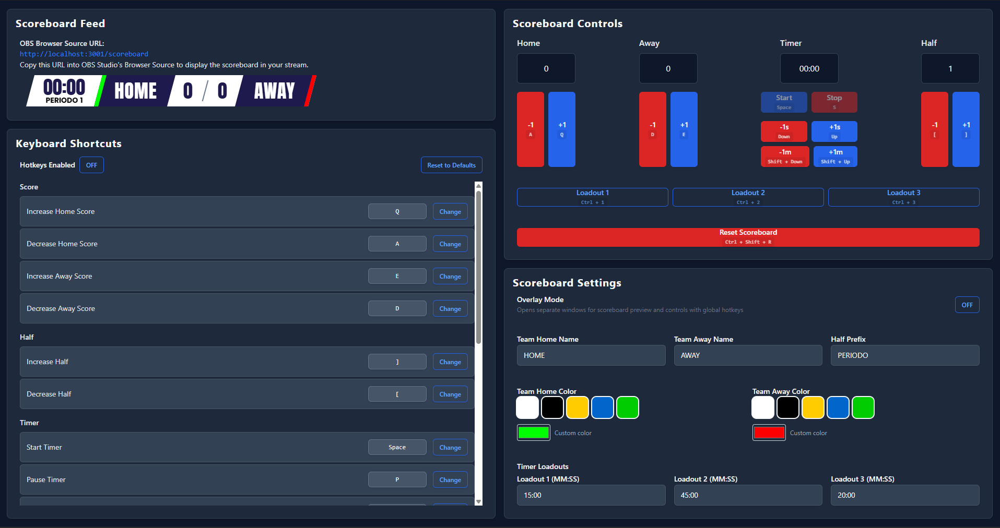
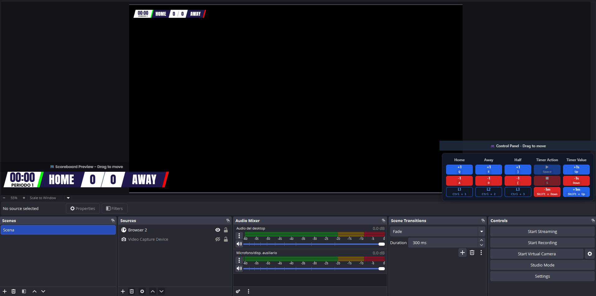

# Scoreboard Server

<div align="center">

A professional real-time scoreboard application for live streaming and sports broadcasting, built with Electron, React, and TypeScript.

[](LICENSE)
[](package.json)

</div>

---

## 📋 Table of Contents

- [Features](#-features)
- [Screenshots](#-screenshots)
- [Installation](#-installation)
- [Usage](#-usage)
- [LAN Remote Control](#lan-remote-control)
- [Buzzer](#-buzzer)
- [Overlay Mode](#overlay-mode)
- [Match Recording](#-match-recording)
- [Video Generator](#-video-generator)
- [Hotkey Configuration](#hotkey-configuration)
- [OBS Studio Integration](#-obs-studio-integration)
- [Development](#development)
- [Building](#building)
- [Tech Stack](#-tech-stack)
- [License](#-license)

---

## ✨ Features

### Core Functionality

- **Real-time Score Management** - Control home and away team scores with instant updates
- **Game Timer** - Countdown timer with play, pause, and stop controls
- **Half/Period Tracking** - Track game periods or halves with customizable labels
- **Customizable Teams** - Configure team names and brand colors
- **Timer Loadouts** - Quick-access presets for common timer durations (e.g., 15:00, 45:00, 20:00)

### Advanced Features

- **LAN Remote Control** - Control the scoreboard from any phone or tablet on the same network
- **Buzzer** - Audible alert when the timer reaches zero, with manual trigger and auto-play toggle
- **Overlay Mode** - Separate windows for controls and preview, perfect for multi-monitor setups
- **Global Hotkeys** - Control everything without focusing the app window
- **Browser Source Support** - Seamless integration with OBS Studio and streaming software
- **WebSocket Server** - Real-time updates to all connected clients (bidirectional)
- **Match Recording** - Record every second of your match for later review or video generation
- **Video Generator** - Create highlight videos from your recorded match data

### Customization

- **Team Colors** - Visual color picker with preset palette for team branding
- **Custom Labels** - Rename teams and period/half prefixes
- **Flexible Hotkeys** - Fully customizable keyboard shortcuts with duplicate detection
- **Responsive Design** - Clean, modern UI that scales beautifully

---

## 📸 Screenshots

### Main Application View



### Example Usage with OBS Studio



<details>
<summary><strong>Disclaimer about OBS Studio in screenshots</strong></summary>

The OBS Studio interface shown in the screenshot is for demonstration purposes only. Scoreboard Server does not include, modify, or distribute any OBS Studio code or assets. The OBS Studio view is used solely to illustrate how Scoreboard Server can be integrated as a browser source in streaming setups. All rights to OBS Studio belong to their respective owners.

</details>

---

## 🔍 Zooming In and Out

Scoreboard Server supports zooming the interface for better visibility or to fit your screen:

1. Press the <kbd>Alt</kbd> key to reveal the application menu at the top of the window.
2. Click on the <strong>View</strong> menu.
3. Select <strong>Zoom In</strong> or <strong>Zoom Out</strong> to adjust the interface size.

This feature is available on all platforms and works in both the main window and overlay windows. Use it to make the scoreboard easier to read or to fit your workflow.

---

## 📦 Installation

### Prerequisites

- **Node.js** 18+ and **pnpm** package manager
- **Windows**, **macOS**, or **Linux**

### Quick Start

1. **Clone the repository**

   ```bash
   git clone https://github.com/d-luca/scoreboard_server.git
   cd scoreboard_server
   ```

2. **Install dependencies**

   ```bash
   pnpm install
   ```

3. **Run the application**
   ```bash
   pnpm dev
   ```

---

## 🎯 Usage

### Main Application

When you launch Scoreboard Server, you'll see the main control interface with two sections:

#### Scoreboard Controls

- **Team Scores**: Use +/- buttons to adjust home and away scores
- **Timer**: Start, pause, stop, and manually adjust the game timer
- **Half/Period**: Track game periods with increment/decrement controls
- **Timer Loadouts**: Quickly set common timer values (configurable in settings)
- **Reset**: Clear all scores and timer data

#### Scoreboard Settings

- **Overlay Mode**: Enable separate preview and control windows
- **Team Names**: Customize home and away team names
- **Team Colors**: Select brand colors for visual representation
- **Half Prefix**: Change the period label (e.g., "PERIOD", "HALF", "QUARTER")
- **Timer Loadouts**: Configure three preset timer durations for play/pause time or whatever you need

### Scoreboard Feedback

View your scoreboard design in real-time with the integrated preview. The scoreboard displays:

- Team names with colored indicators
- Current scores
- Game timer (countdown format)
- Current half/period

---

## LAN Remote Control

Scoreboard Server exposes a mobile-friendly web control panel accessible from any device on the same network. This is designed for a referee or scorekeeper at the game table.

### Accessing the Remote Control

1. Start the application
2. In **Scoreboard Settings**, find the **LAN Remote Control** section showing one or more URLs
3. Open the displayed URL on a phone, tablet, or any browser on the same network (e.g. `http://192.168.1.x:3001/control`)
4. The remote control page connects instantly via WebSocket

### Remote Control Features

- **Score Control** - Large +/- buttons for home and away scores
- **Timer Control** - Start, pause, reset, ±1s, ±1m, and custom timer set
- **Timer Presets** - Quick loadout buttons matching the app's configured durations
- **Half/Period Control** - Increment and decrement the current period
- **Team Settings** - Change team names and colors (with preset color palette)
- **Half Prefix** - Edit the period label
- **Timer Loadouts** - Configure the three preset durations
- **Buzzer** - Manual buzzer trigger and auto-buzzer toggle
- **Reset All** - Clear all scores and timer in one action
- **Connection Status** - Live indicator showing WebSocket connection state
- **Auto-Reconnect** - Automatically reconnects if the phone loses WiFi momentarily

### How Input Submission Works

Text fields (team names, half prefix, loadouts) are applied when you **press Enter** or **leave the field** (tap outside). This avoids accidental partial updates while typing.

### Network Requirements

- The phone/tablet must be on the **same local network** (WiFi/LAN) as the PC running Scoreboard Server
- Windows Firewall may prompt to allow incoming connections on port 3001 the first time
- No authentication is required (designed for trusted LAN environments)
- Multiple devices can connect simultaneously

### WebSocket Command Protocol

The remote control communicates over a bidirectional WebSocket on the same port (3001). Clients send JSON command messages and receive state broadcasts:

```json
{ "type": "command", "action": "score:home:inc" }
{ "type": "command", "action": "timer:start" }
{ "type": "command", "action": "update", "data": { "teamHomeName": "Eagles" } }
```

This protocol is also available to third-party integrations that want to control the scoreboard programmatically.

---

## 🔔 Buzzer

A built-in audible buzzer alerts everyone when the game timer reaches zero.

### Buzzer Controls

- **Manual Trigger** - Press the Buzzer button to play the sound at any time
- **Auto-Buzzer Toggle** - When enabled (default: ON), the buzzer plays automatically when the countdown timer finishes
- Available in the main app **Timer Controls**, the **Overlay Control** window, and the **LAN Remote Control** page

### How It Works

1. When the timer counts down to 0 while running, the server broadcasts a `timer-finished` event
2. All connected clients (app windows and remote control pages) receive the event
3. If auto-buzzer is enabled on that client, the buzzer sound plays locally on the device
4. The buzzer sound can also be triggered manually at any time, regardless of the auto setting

### Notes

- The buzzer plays on the **device where the control page or app is open** (e.g. the referee's phone)
- On mobile browsers, the first buzzer tap may require user interaction to unlock audio playback (browser autoplay policy)
- The auto-buzzer setting is per-client and not synced across devices

---

## Overlay Mode

Overlay Mode is designed for streamers and broadcasters who need dedicated control and preview windows:

### Activating Overlay Mode

1. Navigate to **Scoreboard Settings**
2. Toggle **Overlay Mode** to **ON**
3. Two new windows will appear:
   - **Overlay Preview**: Shows the scoreboard display (for reference)
   - **Overlay Controls**: Compact control panel with all functions

### Overlay Controls Window

The compact control panel features:

- **5-Column Layout**: Home, Away, Half, Timer Actions, Timer Values
- **Visual Hotkey Indicators**: Each button shows its assigned hotkey
- **Quick Access**: All controls accessible without switching windows
- **Always on Top**: Stays visible while working in other applications

### Benefits

- Control scoreboard from any window with global hotkeys
- Keep preview visible while streaming
- Compact interface perfect for small screens
- Independent window positioning

### Disclaimer

When in overlay mode, if the hotkeys are enabled, they will be globally registered, this mean that they will work even when you are not focusing the main app or the overlay

---

## 🎬 Match Recording

Scoreboard Server can record all scoreboard data during a match, capturing a snapshot every second. This data can be used to generate later a video with the scoreboard, useful for embedding the scoreboard on videos using other video editing programs.

### Starting a Recording

1. Navigate to the **Recording Controls** section in the main window or overlay controls
2. (Optional) Click **Change Directory** to select where recordings are saved
3. Click the **Record** button (🔴) to start recording
4. The recording indicator will show the elapsed time and snapshot count
5. Click **Stop** (⬛) to end the recording

### Recording Output

- Recordings are saved as JSON files with the naming format: `{HomeTeam}-{AwayTeam}-{Timestamp}.json`
- Each recording contains:
  - **Metadata**: Team names, recording ID, start/end times
  - **Snapshots**: One per second, containing scores, timer, half, team colors, and timestamps

### Recording Features

- **Background Recording**: Snapshots are captured in the main process, ensuring reliable 1-second intervals even when the app window is minimized
- **Multi-Window Support**: Recording status is synced across all windows (main app and overlay)
- **Compact Controls**: Recording controls are available in both the main window and the compact overlay control panel

---

## 🎥 Video Generator

The Video Generator allows you to create video files from your recorded match data. This is useful for embedding the scoreboard on videos using other video editing programs.

### Opening the Video Generator

1. From the main application, click **Open Video Generator** in the toolbar or settings
2. A new window will open with the video generation interface

### Generating a Video

1. **Select Recording File**: Click **Browse** to select a previously saved `.json` recording file
2. **Review Recording Info**: The generator displays metadata about the recording (teams, duration, snapshots)
3. **Select Output File**: Click **Browse** next to Output File to choose where to save the video
4. **Configure Settings**:
   - **Frame Rate**: Choose from 1 to 60 FPS (default 30FPS)
5. **Generate**: Click **Generate Video** to start the rendering process
6. **Monitor Progress**: A progress bar shows the current rendering status
7. **Cancel**: You can cancel generation at any time if needed

### Tips

- Longer recordings will take more time to render
- Higher frame rates increase rendering time and file size

---

## Hotkey Configuration

Scoreboard Server includes fully customizable global hotkeys that work even when the app is in the background.

### Default Hotkeys

#### Score Control

- **Increase Home Score**: `W`
- **Decrease Home Score**: `Q`
- **Increase Away Score**: `E`
- **Decrease Away Score**: `D`

#### Timer Control

- **Start Timer**: `Space`
- **Pause Timer**: `P`
- **Stop Timer**: `S`
- **+1 Second**: `↑` (Up Arrow)
- **-1 Second**: `↓` (Down Arrow)
- **+1 Minute**: `Shift + ↑`
- **-1 Minute**: `Shift + ↓`

#### Timer Loadouts

- **Loadout 1**: `Ctrl + 1`
- **Loadout 2**: `Ctrl + 2`
- **Loadout 3**: `Ctrl + 3`

#### Half/Period

- **Increase Half**: `]`
- **Decrease Half**: `[`

#### Other

- **Reset Scoreboard**: `Ctrl + Shift + R`

### Customizing Hotkeys

1. Click the **Hotkey Settings** button in the main window
2. Browse hotkeys organized by category (Score, Timer, Half, Loadouts, Other)
3. Click **Change** next to any hotkey
4. Press your desired key combination
5. The app will warn you if the key is already assigned
6. Click **Reset to Defaults** to restore original hotkeys
7. Toggle **Enable Hotkeys** to temporarily disable all shortcuts

### Hotkey Features

- **Modifier Support**: Combine with Ctrl, Alt, and Shift
- **Conflict Detection**: Automatic duplicate detection
- **Visual Feedback**: Hotkey badges on all buttons

---

## 📡 OBS Studio Integration

### Adding the Scoreboard to OBS

1. **Start Scoreboard Server**
2. In OBS Studio, add a new **Browser Source**
3. Configure the source:
   - **URL**: `http://localhost:3001/scoreboard`
   - **Width and Height**: The scoreboard is define to fill the entire space available, therefore you can adjust its dimension directly from the OBS Scene component
   - ✅ Check **Shutdown source when not visible**
   - ✅ Check **Refresh browser when scene becomes active**

4. Position and resize the source in your scene
5. Control the scoreboard from the app while streaming

### Tips for Streaming

- The scoreboard updates in real-time via WebSocket
- Use **Overlay Mode** for better workflow during streams
- Use hotkeys to control the scoreboard without switching windows
- The scoreboard has a transparent background for easy integration
- The server is now accessible on the LAN — use the OBS host machine's IP if OBS runs on a different PC

---

## Development

### Recommended IDE Setup

- [Visual Studio Code](https://code.visualstudio.com/)
- [ESLint Extension](https://marketplace.visualstudio.com/items?itemName=dbaeumer.vscode-eslint)
- [Prettier Extension](https://marketplace.visualstudio.com/items?itemName=esbenp.prettier-vscode)

### Available Scripts

```bash
# Start development mode
pnpm dev

# Start with scoreboard build watching
pnpm dev:with-scoreboard

# Run type checking
pnpm typecheck

# Lint code
pnpm lint

# Format code
pnpm format

# Build scoreboard only
pnpm build:scoreboard

# Start preview mode (after building)
pnpm start
```

### Project Structure

```
src/
├── main/               # Electron main process
│   ├── index.ts        # Main entry, window management, IPC
│   ├── server.ts       # Express + WebSocket server (0.0.0.0:3001)
│   ├── ssr.ts          # Server-side rendering for scoreboard
│   └── controlPage.ts  # Standalone LAN remote control page HTML
├── preload/            # Preload scripts for IPC
├── renderer/           # React frontend
│   └── src/
│       ├── components/  # React components
│       ├── stores/      # Zustand state management (incl. buzzerStore)
│       ├── hooks/       # Custom React hooks
│       └── pages/       # Page components
├── types/              # Shared TypeScript types
resources/
└── buzzer.mp3          # Buzzer audio file
```

---

## Building

Build executables for distribution:

```bash
# Windows
pnpm build:win

# macOS
pnpm build:mac

# Linux
pnpm build:linux
```

The built applications will be in the `dist/` directory.

### Build Configuration

The build process uses `electron-builder`. Configuration is in `electron-builder.yml`:

- **Product Name**: Scoreboard Server
- **App ID**: `com.github.d-luca.scoreboard-server`
- Includes SSR scoreboard files
- Creates installers for each platform

---

## 🔧 Tech Stack

### Frontend

- **React 19** - UI framework
- **TypeScript** - Type-safe development
- **Tailwind CSS 4** - Utility-first styling
- **Zustand** - State management
- **Radix UI** - Accessible component primitives

### Backend

- **Electron 38** - Desktop application framework
- **Express 5** - HTTP server (binds to `0.0.0.0` for LAN access)
- **WebSocket (ws)** - Bidirectional real-time communication
- **Node.js** - Runtime environment

### Build Tools

- **Vite 7** - Fast bundler and dev server
- **electron-vite** - Electron integration
- **electron-builder** - Application packaging
- **ESLint + Prettier** - Code quality and formatting

---

## 📄 License

This project is licensed under the MIT License - see the [LICENSE](LICENSE) file for details.

---

## 👤 Author

**Luca Davi**

- GitHub: [@d-luca](https://github.com/d-luca)
- Project Link: [https://github.com/d-luca/scoreboard_server](https://github.com/d-luca/scoreboard_server)

---

## 🙏 Acknowledgments

- Built with [Electron](https://www.electronjs.org/)
- UI components from [Radix UI](https://www.radix-ui.com/)
- Styled with [Tailwind CSS](https://tailwindcss.com/)

---

<div align="center">

**Made with ❤️ for the emerging sports community**

If this project helps you, please consider giving it a ⭐️!

</div>
