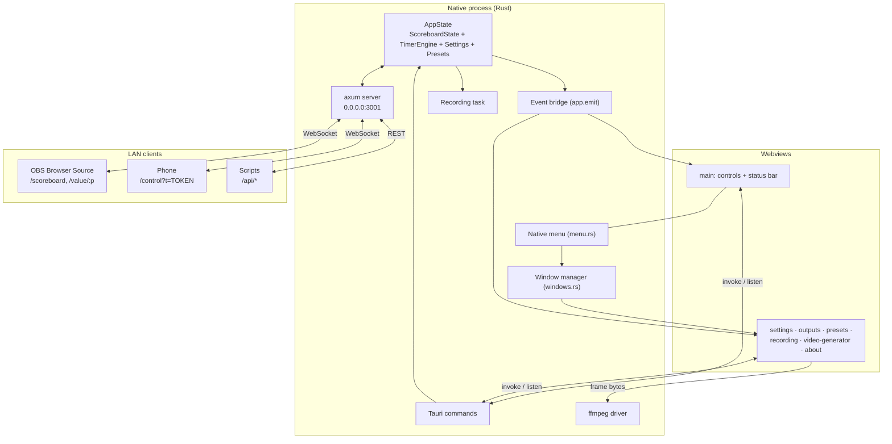

# Architecture

Scoreboard Server is a desktop app for live sports streaming. It keeps one authoritative
**match state** (team names, colours, scores, timer, period) and publishes it to:

1. the **desktop control UI**, where the operator drives the match;
2. an **HTTP/WebSocket server on the LAN**, so OBS Studio can render the scoreboard as a
   Browser Source and a phone can act as a remote control;
3. optional **match recordings**, which can later be rendered to a transparent video.

The defining constraint: **the timer must never drift and never be throttled**, whichever
window has focus and however loaded the machine is. See [timer.md](timer.md).

## Process model

One native Rust process hosts every webview and the LAN server.



**Rust is always the source of truth.** Every mutation is a command to Rust and every UI
update arrives as a broadcast event. Webviews never mutate state locally.

**The main window is a control surface, not a dashboard.** It holds only the scoreboard
values, the buttons that change them, and a status bar. Settings, preview/sharing,
presets, recording and video generation each live in a dedicated window opened from the
native menu.

### Key design decisions

| Decision                                    | Rationale                                                                   |
| ------------------------------------------- | --------------------------------------------------------------------------- |
| Tauri v2, pure Rust backend (axum)          | One small process, no Node runtime or sidecar server                        |
| React + Vite, no SSR, no Next.js            | Tauri serves a static bundle; Vite handles the many HTML entry points       |
| Rust owns all state; the UI is a view       | Removes a whole class of desync bugs and any timer-ownership handoff        |
| Types generated from Rust with ts-rs        | Contracts cannot drift between backend and frontend                         |
| `/control` is a real React app              | Shares components and styling with the desktop UI                           |
| Token-protected writes on the LAN           | Nobody on the venue Wi-Fi can change the score without the token            |
| Configurable port with automatic fallback   | 3001 collides more often than expected                                      |
| ffmpeg sidecar fed by a canvas in a webview | No headless browser, no temp PNGs                                           |
| Every secondary feature is its own window   | Keeps the operating surface small; windows can be parked on another monitor |

### Non-goals

Cloud sync, accounts, multiple simultaneous scoreboards in one instance, tournament
brackets, a native mobile app (the `/control` page covers phones), macOS builds (nothing
in the design blocks them).

## Repository layout

```
src-tauri/
  src/
    lib.rs          builder, setup(), every #[tauri::command], invoke handler
    state.rs        AppState, dispatch(), publish(), validation, persistence scheduling
    timer.rs        TimerEngine (monotonic, countdown / count-up)
    settings.rs     Settings load/save/migrate, apply identity to the scoreboard
    presets.rs      team & match presets, presets.json
    menu.rs         native menu bar, menu events, debounced rebuild
    windows.rs      AppWindow singleton manager, geometry and zoom
    net.rs          LAN address discovery
    recording.rs    .sbrec writer and reader (+ legacy .json importer)   [feature "recording"]
    video.rs        ffmpeg driver                                         [feature "video"]
    bindings.rs     ts-rs export surface
    server/
      mod.rs        router, bind with port fallback
      routes.rs     REST handlers, /buzzer.mp3
      ws.rs         /ws handler, rate limit, heartbeat
      auth.rs       control token, cookie, bearer
      assets.rs     rust-embed of dist/, page bootstrap injection
  tests/export_bindings.rs   regenerates src/bindings (pnpm bindings)
  assets/buzzer.mp3          default buzzer, compiled into the binary
  capabilities/default.json  one capability for all windows
src/
  bindings/        generated TypeScript types — never edit by hand
  entries/         one entry per HTML page (desktop windows and LAN pages)
  components/      Scoreboard, ScoreboardControl, StatusBar, ui primitives, icons
  features/remote/ the /control phone remote
  lib/             transports, stores, hooks, format, scoreboard geometry, canvas renderer
pages/             HTML shells, one per entry
scripts/           dev.mjs, fetch-ffmpeg.mjs, WS smoke tests
```

Cargo features: `recording` and `video` (both on by default). An `overlay` feature flag
exists but the overlay is not implemented yet — see
[features/overlay.md](features/overlay.md).

## State and the single mutation path

[`AppState`](../src-tauri/src/state.rs) is shared as `Arc<AppState>`: registered with
`app.manage()` **and** passed as the axum router state, so commands and LAN handlers touch
the same allocation. It holds the `ScoreboardState`, `Settings`, the preset library, the
`TimerEngine`, the control token, the window prefs and a `broadcast` channel of
`ServerEvent`s.

Every mutation — Tauri commands, WebSocket commands, REST, the timer tick, menu items —
goes through **`AppState::dispatch(Action)`**. There is exactly one place that writes
`ScoreboardState`. Adding a feature means adding an `Action` variant, and the compiler
points at every place that must handle it. The action list and its semantics are in
[protocol.md](protocol.md#actions).

Invariants:

- **The write guard is dropped before `publish`.** A listener that calls back into a
  command while the guard is held deadlocks the app.
- `revision` is bumped on every dispatch, including no-ops, so clients can detect
  liveness and order frames.
- `timer` inside a `Patch` is routed to `TimerSet`, never written directly, or a patch
  would desync the running engine.
- Settings that also live in the scoreboard (names, colours, prefix, loadouts, timer
  direction) are written through `settings_set`, which mirrors them into the live state.
  `timerDirection` goes through `TimerSetDirection` so the engine stays in sync.
- Validation (names trimmed, non-empty, ≤ 32 chars; colours `#rrggbb` lowercased; half ≥ 1;
  loadouts ≤ 99:59:59) lives in `state.rs` and is reused by presets.

### Event flow

`publish(ServerEvent)` sends each event to the broadcast channel (LAN clients) and emits
the matching Tauri event to the webviews:

```
Button / phone / REST / menu / timer tick
  └─> AppState::dispatch(action)
        ├─ write lock: mutate, bump revision, clone snapshot   (guard dropped)
        └─ publish(ServerEvent::State(snapshot))
              ├─> app.emit("state:changed")         → every webview
              └─> broadcast channel → ws.rs         → every LAN socket (full state frame)
```

The full event list is in [protocol.md](protocol.md#tauri-events).

### Concurrency rules

- `tokio::sync::RwLock` / `Mutex`, not `std`, because guards are held across `.await` in
  handlers.
- Lock order is **scoreboard → timer engine**. The timer tick task takes the engine lock
  only to read the displayed value and releases it before publishing, which takes the
  scoreboard lock.
- Never hold a lock across `app.emit()` or `publish()`: clone, drop the guard, then emit.
- `broadcast::Sender::send` fails when there are no receivers; that is normal.
- A lagging broadcast receiver (`RecvError::Lagged`) is resynced with a fresh full state
  instead of being dropped.

## Persistence

All files live in `app_config_dir()`:

| File                   | Contents                                              | Source                                      |
| ---------------------- | ----------------------------------------------------- | ------------------------------------------- |
| `settings.json`        | [`Settings`](../src/bindings/Settings.ts)             | [settings.rs](../src-tauri/src/settings.rs) |
| `presets.json`         | [`PresetLibrary`](../src/bindings/PresetLibrary.ts)   | [presets.rs](../src-tauri/src/presets.rs)   |
| `window-geometry.json` | Per-label window geometry (incl. scale factor) + zoom | [state.rs](../src-tauri/src/state.rs)       |

Common rules:

- **Load never fails.** A missing file gives defaults; a corrupt `settings.json` /
  `presets.json` is renamed to `<name>.corrupt-<unix_ts>.json` and defaults are used.
- **Save is atomic**: write `<name>.tmp`, `sync_all`, rename over the real file.
- **Saves are debounced** (500 ms) by the callers that mutate rapidly.
- `schemaVersion` plus `#[serde(default)]`: unknown or missing fields fall back to
  defaults.

Team identity, prefix, loadouts, timer direction and score animation are persisted in
`Settings`; scores, half and the timer value are not.

## Windows

Only `main` is declared in [`tauri.conf.json`](../src-tauri/tauri.conf.json). Every other
window is created on demand by [`windows.rs`](../src-tauri/src/windows.rs).

| Label             | Size (min)         | Opened by                                      |
| ----------------- | ------------------ | ---------------------------------------------- |
| `main`            | 720×560 (640×480)  | Startup; starts hidden                         |
| `splash`          | 300×180, frameless | `setup()`; closed by `startup_ready`           |
| `settings`        | 760×620 (640×520)  | Scoreboard › Settings…, status bar badges      |
| `outputs`         | 820×640 (700×520)  | Broadcast › Outputs & Sharing…, status bar     |
| `presets`         | 820×620 (700×520)  | Presets › Manage Presets…                      |
| `recording`       | 560×420            | Broadcast › Recording…, REC badge              |
| `video-generator` | 900×700            | Broadcast › Video Generator…, recording window |
| `about`           | 420×320            | Help › About                                   |

**Startup handshake.** `main` is `visible: false`. `setup()` builds an always-on-top
`splash` window to cover WebView initialization. When the main React shell mounts it
invokes `startup_ready`, which shows and focuses `main` and closes `splash`.

Rules:

- Every feature window is a **singleton** keyed by its label; opening an open window
  unminimizes and focuses it.
- Feature windows are ordinary windows — not children of `main`, not always-on-top.
- Geometry and zoom are restored on open (clamped to a visible monitor) and saved on
  move/resize, debounced. Sizes are stored physical with the scale factor and restored
  logical.
- Closing `main` exits the app.
- <kbd>Esc</kbd> closes `settings`, `outputs` and `about`. The Presets window discards a
  dirty draft first. `recording` and `video-generator` ignore Esc so it cannot interrupt
  work.
- Webviews open windows with `invoke("window_open", { which })`; the menu calls the same
  function, so a menu item and a button cannot diverge.
- Every window using `invoke` must be listed in
  [`capabilities/default.json`](../src-tauri/capabilities/default.json).

## Menu bar

Built in [`menu.rs`](../src-tauri/src/menu.rs) and attached to `main` only with
`main_window.set_menu(...)` (never `app.set_menu`, see [pitfalls.md](pitfalls.md)).

| Menu           | Item                       | Id                         | Accelerator                       |
| -------------- | -------------------------- | -------------------------- | --------------------------------- |
| **Scoreboard** | Settings…                  | `open:settings`            | `Ctrl+,`                          |
|                | Quit                       | predefined item            | platform default                  |
| **View**       | Zoom In / Zoom Out / Reset | `view:zoom-*`              | `Ctrl+Plus` / `Ctrl+-` / `Ctrl+0` |
| **Presets**    | Manage Presets…            | `open:presets`             | `Ctrl+P`                          |
|                | _one item per fixture_     | `preset:load:<id>`         | —                                 |
|                | Timer 1/2/3 (MM:SS)        | `timer:loadout:<n>`        | — (on purpose)                    |
| **Broadcast**  | Outputs & Sharing…         | `open:outputs`             | `Ctrl+O`                          |
|                | Overlay Mode               | `tools:overlay`            | `F9` — `overlay` feature only     |
|                | Recording…                 | `open:recording`           | `Ctrl+R` (release builds)         |
|                | Video Generator…           | `open:video`               | —                                 |
| **Help**       | Documentation / About      | `help:docs` / `open:about` | —                                 |

- Items for features that were not compiled in are omitted, not greyed out.
- The fixture list shows at most 20 match presets, or a disabled "No presets saved".
- The `Timer n` items have no accelerator: `Ctrl+1/2/3` stay webview hotkeys, whose
  editable-field guard a native accelerator would bypass.
- The menu is rebuilt by `spawn_menu_rebuilder` on `ServerEvent::Presets` or when the
  loadout triple changes, debounced 500 ms, on the main thread.

## Glossary

| Term            | Meaning                                                          |
| --------------- | ---------------------------------------------------------------- |
| Match state     | The single `ScoreboardState` owned by Rust                       |
| Loadout         | A preset timer duration in seconds (three slots)                 |
| Half / period   | Integer ≥ 1, displayed after `halfPrefix`                        |
| Feature window  | A singleton secondary window opened from the menu                |
| Fixture         | A match preset: two team presets plus an optional label          |
| Snapshot        | One per-second capture of the match state in a recording         |
| Sidecar         | An external binary bundled with the app (here: ffmpeg)           |
| Capability      | Tauri v2 permission manifest granting windows access to commands |
| Control token   | Random secret required for LAN writes                            |
| Internal client | An in-app WebSocket (`?internal=1`), not counted as a LAN client |
