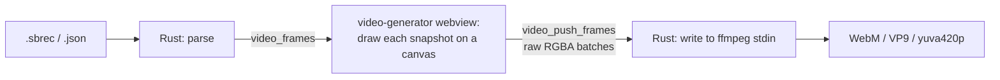

# Match recording and video generation

Two related features behind Cargo features `recording` and `video` (both default). With
them disabled, the Broadcast menu has no entries for them and the windows cannot be
opened.

Sources: [`recording.rs`](../../src-tauri/src/recording.rs),
[`video.rs`](../../src-tauri/src/video.rs), commands in [`lib.rs`](../../src-tauri/src/lib.rs),
windows in [`src/entries/Recording/`](../../src/entries/Recording/) and
[`src/entries/VideoGenerator/`](../../src/entries/VideoGenerator/), render loop in
[`videoGeneration.ts`](../../src/lib/videoGeneration.ts) and
[`renderScoreboardToCanvas.ts`](../../src/lib/renderScoreboardToCanvas.ts).

## Recording

While recording, the full match state is captured once per second and appended to disk.

### `.sbrec` format

Line-delimited JSON: a header line, one snapshot per line, and a trailer on stop.

```
{"version":2,"recordingId":"<uuid>","startedAt":"2026-08-14T12:30:45Z","homeName":"HOME","awayName":"AWAY"}
{"t":0,"hs":0,"as":0,"tm":900,"hf":1,"hn":"HOME","an":"AWAY","hc":"#00ff00","ac":"#ff0000","hp":"PERIODO"}
{"t":1,"hs":0,"as":0,"tm":899,"hf":1,...}
{"endedAt":"2026-08-14T14:05:12Z","totalSnapshots":5427}
```

- Append-only through a `BufWriter`, flushed every second: crash-safe (at most the last
  second is lost), constant memory, streamable.
- A **missing trailer** means the recording was interrupted; the reader tolerates it and
  counts lines. On app exit (`RunEvent::ExitRequested`) an active recording is flushed and
  gets its trailer.
- Snapshot fields ([`Snapshot`](../../src/bindings/Snapshot.ts)): `t` relative seconds
  from 0, `hs`/`as` scores, `tm` timer, `hf` half, `hn`/`an` names, `hc`/`ac` colours,
  `hp` half prefix. Identity repeats on every line (~120 B/s, ~650 KB per 90 min) so each
  line renders on its own.
- **Legacy import**: pretty-printed `.json` recordings from the old Electron app
  (`"version": "1.0"`) are still readable.

### Behaviour

- The first snapshot is written **one second after start, with `t = 0`**. Changing this
  shifts every generated video by a second.
- Directory: `settings.recordingOutputDir`, default `Documents/ScoreboardRecordings`,
  created on first use.
- Filename: `<home>-<away>-<ISO timestamp, no ms, ':' → '-'>.sbrec`. Names are sanitized
  (anything outside `[a-zA-Z0-9-_]` → `_`, repeats collapsed, edges trimmed); a clash gets
  a `-2`, `-3`… suffix.
- Starting while recording → `"Recording already in progress"`; stopping while idle →
  `"No active recording"`.
- `recording:status` ([`RecordingStatus`](../../src/bindings/RecordingStatus.ts)) is
  emitted on start, stop and every snapshot; `ServerStatus.recordingSeconds` drives the
  REC badge.

Commands: `recording_start`, `recording_stop` →
[`RecordingStopped`](../../src/bindings/RecordingStopped.ts), `recording_status`,
`recording_get_output_dir`, `recording_select_output_dir` (folder dialog, persisted),
`recording_list_recent` (newest 10 `.sbrec`/`.json`).

### Recording window

560×420, opened from Broadcast › Recording… (`Ctrl+R`) or the REC badge. Output directory
with Change (disabled while recording), Start/Stop with in-flight labels, pulsing
`REC MM:SS`, recent recordings with _Reveal in folder_, and _Generate Video from
Recording…_ (disabled while recording). **Closing the window does not stop the
recording**; the status bar keeps counting.

## Video generation

Turns a recording into a **transparent WebM (VP9 + alpha)** of the scoreboard for
post-production.

### Pipeline



No offscreen browser window, no screenshots, no temp files.

**Why a canvas.** The scoreboard is a skewed DOM composition and Tauri has no API to
rasterize a webview, so it is re-drawn in Canvas2D by `renderScoreboardToCanvas`. Both
the component and the renderer import the constants from
[`scoreboardGeometry.ts`](../../src/lib/scoreboardGeometry.ts). Fonts are awaited
(`document.fonts.load` / `ready`) before the first frame.

**Frame size.** 622 × 80 at scale 1 (the 600-wide board plus room for the −15° skew,
identical to the OBS frame), multiplied by the scale (0.5 / 1 / 2 / 3) and rounded to
**even** numbers for VP9.

**Frame transport.** The webview fetches snapshots in batches of 30 (`video_frames`),
renders them, and sends one `Uint8Array` per batch as the **sole** invoke argument — Tauri
then sends it as a raw `application/octet-stream` body. (A typed array nested in a JSON
args object is expanded into a JSON number array, several times larger.) Layout:
`[u32 LE start][u32 LE frame_count][frames…]`, each frame `width × height × 4` bytes.
`video_push_frames` awaits the write into ffmpeg's stdin, so the webview throttles itself:
one batch in flight, memory flat regardless of recording length.

### ffmpeg

```
ffmpeg -y -f rawvideo -pix_fmt rgba -s <W>x<H> -r 1 -i pipe:0
       -r <frameRate> -c:v libvpx-vp9 -pix_fmt yuva420p -auto-alt-ref 0 -b:v 2M
       -progress pipe:1 -nostats <output.webm>
```

- Input 1 fps (one frame per recorded second); output `frameRate` (1–60, default 30);
  ffmpeg duplicates frames.
- `yuva420p` **and** `-auto-alt-ref 0` are both required; dropping either silently kills
  transparency.
- `-progress pipe:1` gives machine-readable progress. stdout must be drained continuously
  (a full pipe deadlocks the encoder); a bounded stderr tail is kept for error messages.
- Resolution: bundled sidecar `binaries/ffmpeg-<target-triple>[.exe]` in the resource dir,
  else `ffmpeg` on `PATH`. Spawned with `std::process::Command`. See
  [build-release.md](../build-release.md#ffmpeg-sidecar).
- The child is reaped by polling `try_wait`, never a blocking `wait` under the child
  mutex, so cancel can always kill it.

### Progress and cancellation

[`GenerationProgress`](../../src/bindings/GenerationProgress.ts) on `video:progress` to the
generator window, throttled to 10 Hz; `video_progress` seeds a freshly opened window.
Steps: `parsing` 0–5 %, `rendering` 10–60 % (overlaps encoding while streaming),
`encoding` 60–95 % while ffmpeg drains, `cleanup` → 95 %, `complete` → 100 %, or `error`.

Cancel (`video_cancel`): an `AtomicBool` checked before every batch, plus killing the
child. The partial output is deleted and `{ step: "error", error: "Generation cancelled" }`
is emitted.

### Video Generator window

900×700, from Broadcast › Video Generator… or the recording window (which pre-fills the
path via `video_open_with_recording` / `video_take_pending_recording`).

- **Recording File** — path + Browse, load errors, metadata
  ([`RecordingMetadata`](../../src/bindings/RecordingMetadata.ts): teams, snapshot count,
  start/end) and the first snapshots.
- **Video Settings** — output path + Browse (must end in `.webm`), frame rate slider and
  input (1–60), scale select, progress (status, bar, message, frame counter), Generate /
  Generate Again, Reset, and Cancel while generating.

Config: [`VideoGenerationConfig`](../../src/bindings/VideoGenerationConfig.ts).

## Acceptance criteria

- A 10-minute recording yields a WebM whose duration equals the snapshot count in seconds
  (±1 frame).
- In OBS the output has a transparent background, not black.
- Cancelling halfway leaves no partial file and no ffmpeg process.
- Generating twice in a row without restarting works.
- A legacy v1 `.json` recording imports and generates correctly.
- Peak memory stays flat regardless of recording length.
- Closing the recording window mid-recording keeps recording; reopening it shows the
  correct elapsed time.
