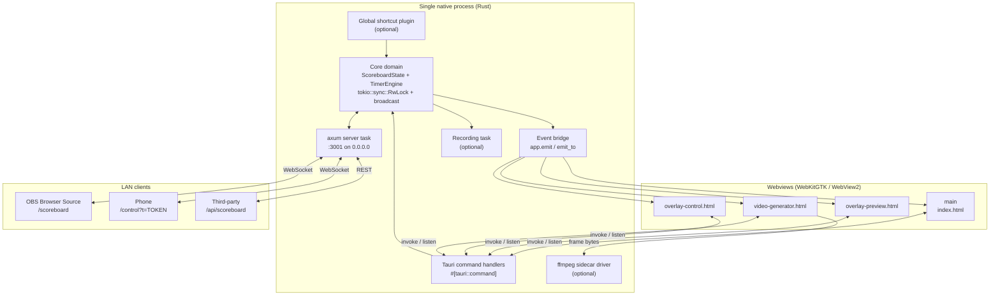

# 01 — Architecture

## 1. Process & thread model

Electron runs a Node main process, a preload script, and N renderer processes.
Tauri runs **one native process** (Rust) hosting N webviews.



**Key inversion vs Electron:** in the Electron app the Zustand store in the renderer is
the de-facto source of truth for many fields, and the main process mirrors it. Here,
**Rust is always the source of truth**. Every mutation is a command to Rust; every UI
update arrives as a broadcast event. This deletes the timer-handoff protocol entirely
(see doc 05 §4).

## 2. Repository layout

```
scoreboard-tauri/
├── package.json                 # frontend deps + scripts
├── vite.config.ts               # multi-entry build
├── tsconfig.json
├── index.html                   # main window entry
├── overlay-control.html         # [OPTIONAL]
├── overlay-preview.html         # [OPTIONAL]
├── video-generator.html         # [OPTIONAL]
├── scoreboard.html              # served over HTTP to OBS
├── control.html                 # served over HTTP to phones
├── src/                         # React sources
│   ├── entries/                 # one tsx per html entry
│   ├── app/                     # main-window pages + layout
│   ├── features/
│   │   ├── scoreboard/          # visual scoreboard component (shared by all entries)
│   │   ├── control/             # score/timer/half controls
│   │   ├── settings/            # settings tabs
│   │   ├── remote/              # LAN /control page
│   │   ├── overlay/             # [OPTIONAL]
│   │   └── video/               # [OPTIONAL]
│   ├── stores/                  # zustand
│   ├── lib/                     # ipc wrappers, ws client, formatters
│   ├── bindings/                # GENERATED by ts-rs — do not edit
│   └── styles/
└── src-tauri/
    ├── Cargo.toml
    ├── tauri.conf.json
    ├── capabilities/
    │   ├── main.json
    │   └── overlay.json         # [OPTIONAL]
    ├── binaries/                # ffmpeg sidecar [OPTIONAL]
    ├── icons/
    └── src/
        ├── main.rs              # bootstrap only
        ├── lib.rs               # builder wiring, plugins, managed state
        ├── state.rs             # ScoreboardState, AppState, broadcast
        ├── timer.rs             # TimerEngine
        ├── commands/            # #[tauri::command] modules
        │   ├── mod.rs
        │   ├── scoreboard.rs
        │   ├── settings.rs
        │   ├── server.rs
        │   ├── recording.rs     # [OPTIONAL]
        │   └── video.rs         # [OPTIONAL]
        ├── server/
        │   ├── mod.rs           # axum router + startup
        │   ├── ws.rs            # websocket upgrade + fanout
        │   ├── routes.rs        # REST + page routes
        │   ├── auth.rs          # control token
        │   └── assets.rs        # rust-embed static serving
        ├── settings.rs
        ├── net.rs               # LAN address enumeration
        ├── recording.rs         # [OPTIONAL]
        ├── video.rs             # [OPTIONAL]
        ├── windows.rs           # [OPTIONAL] overlay window builders
        └── hotkeys.rs           # [OPTIONAL]
```

## 3. Frontend entry points

One Vite build produces every HTML page. Three of them are loaded by Tauri windows over
`tauri://localhost`; two are served over HTTP by axum to LAN clients from the _same_
`dist/` folder, embedded into the binary with `rust-embed`.

| Entry                  | Loaded by                      | Purpose                                         |
| ---------------------- | ------------------------------ | ----------------------------------------------- |
| `index.html`           | Tauri window `main`            | Full desktop control UI                         |
| `overlay-control.html` | Tauri window `overlay-control` | Compact floating controls `[OPTIONAL]`          |
| `overlay-preview.html` | Tauri window `overlay-preview` | Floating scoreboard preview `[OPTIONAL]`        |
| `video-generator.html` | Tauri window `video-generator` | Video generation UI `[OPTIONAL]`                |
| `scoreboard.html`      | HTTP `GET /scoreboard`         | OBS Browser Source `[NEW: replaces SSR]`        |
| `control.html`         | HTTP `GET /control`            | Mobile remote `[NEW: replaces the HTML string]` |

`scoreboard.html` and `control.html` must not import `@tauri-apps/api` — they run in a
plain browser. They talk to the backend **only** over WebSocket + REST. Enforce this with
an ESLint `no-restricted-imports` rule scoped to `src/features/remote/**` and the
scoreboard entry.

> `[NEW]` This is the single biggest simplification of the rebuild. The Electron app
> maintains three separate renderings of the scoreboard (React component, SSR bundle,
> offscreen renderer window) and a hand-written HTML string for the remote. Here there is
> **one** `<Scoreboard/>` component and **one** `<RemoteControl/>` component, built once,
> reused everywhere.

## 4. Electron → Tauri mapping

| Electron concept                     | Tauri v2 replacement                                            |
| ------------------------------------ | --------------------------------------------------------------- |
| `BrowserWindow`                      | `tauri::WebviewWindowBuilder` / `webviews` in `tauri.conf.json` |
| `ipcMain.handle(ch, fn)`             | `#[tauri::command] async fn fn(...) -> Result<T, String>`       |
| `ipcMain.on(ch, fn)`                 | Same, returning `()`                                            |
| `webContents.send(ch, payload)`      | `app.emit(ch, payload)` / `window.emit_to(label, ...)`          |
| `contextBridge` + `preload/index.ts` | Not needed. `invoke()` + capability files                       |
| `globalShortcut`                     | `tauri-plugin-global-shortcut`                                  |
| `dialog.showOpenDialog`              | `tauri-plugin-dialog`                                           |
| `app.getPath('userData')`            | `app.path().app_config_dir()`                                   |
| `app.getPath('documents')`           | `app.path().document_dir()`                                     |
| `app.getPath('temp')`                | `std::env::temp_dir()`                                          |
| Express + `ws`                       | `axum` (with the `ws` feature) + `tower-http::cors`             |
| React SSR (`ssr.ts`)                 | Client-rendered embedded bundle served by axum                  |
| `ffmpeg-static` + `fluent-ffmpeg`    | `externalBin` sidecar + `tauri-plugin-shell`                    |
| `os.networkInterfaces()`             | `if-addrs` crate                                                |
| `electron-builder`                   | `tauri build` (NSIS/MSI, AppImage/deb)                          |
| `setInterval` timer in main          | `tauri::async_runtime::spawn` + `tokio::time::interval`         |
| `backgroundThrottling: false`        | Not needed — the timer never lives in a webview                 |

## 5. State flow

### 5.1 Mutation originating in the desktop UI

```
Button onClick
  └─> invoke("sb_score_home_inc")
        └─> command handler locks AppState, mutates, bumps revision
              ├─> app.emit("state:changed", &state)      → every webview updates
              └─> broadcast_tx.send(StateChanged)        → axum WS task fans out to LAN
```

### 5.2 Mutation originating on the LAN

```
Phone sends {"type":"command","action":"score:home:inc"}
  └─> axum ws task validates token + payload
        └─> same command function as above (shared `domain::apply(...)`)
              ├─> app.emit("state:changed", ...)          → desktop UI updates
              └─> broadcast to all other WS clients
```

**Rule:** every mutation path funnels through one function in `state.rs`. There is exactly
one place where `ScoreboardState` is written. Command handlers and the WS handler are thin
wrappers.

### 5.3 Timer ticks

```
TimerEngine task (250 ms tick)
  └─> compute remaining = deadline - Instant::now()
        └─> if displayed_seconds changed:
              ├─> write state.timer
              ├─> app.emit("state:changed", ...)
              └─> broadcast to WS clients
        └─> if remaining == 0:
              ├─> stop engine, set is_timer_running = false
              ├─> app.emit("timer:finished")
              └─> broadcast {"type":"event","event":"timer-finished"}
```

## 6. Concurrency model

```rust
pub struct AppState {
    pub scoreboard: RwLock<ScoreboardState>,
    pub settings:   RwLock<Settings>,
    pub timer:      Mutex<TimerEngine>,
    pub events:     broadcast::Sender<ServerEvent>,   // capacity 256
    pub control_token: String,
}
pub type Shared = std::sync::Arc<AppState>;
```

- `Shared` is registered with `app.manage(shared.clone())` **and** passed as axum router
  state, so both worlds touch the same allocation.
- Use `tokio::sync::RwLock` (not `std`), because locks are held across `.await` in the
  axum handlers.
- `[RISK]` Never hold a lock while calling `app.emit()`. Clone the state snapshot, drop
  the guard, then emit. Holding across an emit will deadlock the moment an event handler
  re-enters a command.
- The broadcast channel carries small enum variants, not the whole state, except for
  `StateChanged(ScoreboardState)` which is cheap enough (a handful of `String`s).
  A lagging receiver is dropped and reconnected — always handle `RecvError::Lagged` by
  re-sending a full snapshot.

## 7. Windows created

| Label             | Size                                  | Flags                                                                                             | Created                                   |
| ----------------- | ------------------------------------- | ------------------------------------------------------------------------------------------------- | ----------------------------------------- |
| `main`            | 900×670, maximized on show            | decorated, resizable                                                                              | At startup, declared in `tauri.conf.json` |
| `overlay-preview` | 600×80 at (50,50)                     | `decorations:false`, `transparent:true`, `alwaysOnTop:true`, `skipTaskbar:true`, `resizable:true` | On enable overlay `[OPTIONAL]`            |
| `overlay-control` | 500×250, bottom-right minus (550,250) | same as above                                                                                     | On enable overlay `[OPTIONAL]`            |
| `video-generator` | 900×700                               | decorated, resizable                                                                              | On demand `[OPTIONAL]`                    |

`[RISK]` Transparent windows on Linux require a running compositor; on some GNOME/Wayland
setups `transparent: true` yields a black background. Document a fallback: a solid dark
background for the overlay control panel (it is already opaque-ish) and, for the preview,
instruct the user to use the OBS browser source instead.

## 8. What gets deleted relative to Electron

| Deleted                                                                                                                                         | Why                                                     |
| ----------------------------------------------------------------------------------------------------------------------------------------------- | ------------------------------------------------------- |
| `src/preload/**`                                                                                                                                | No preload bridge in Tauri                              |
| `src/main/ssr.ts`                                                                                                                               | No SSR; client bundle embedded instead                  |
| `src/main/controlPage.ts`                                                                                                                       | `/control` is a React app now                           |
| `vite.scoreboard.config.ts` + the `build:scoreboard` scripts                                                                                    | Single Vite build                                       |
| `scoreboard-renderer.html` + the offscreen render window                                                                                        | Frames come from a canvas in the video-generator window |
| Timer handoff IPC (`surrender-timer-control`, `overlay-ready`, `receive-timer-control`, `timer-control-surrendered`, `overlay-timer-surrender`) | Rust owns the timer; no ownership to hand over          |
| `useScoreboardData` hook                                                                                                                        | Superseded by the single Zustand store fed by events    |
| `electron-builder.yml`, `build/entitlements.mac.plist`                                                                                          | Replaced by `tauri.conf.json`                           |
