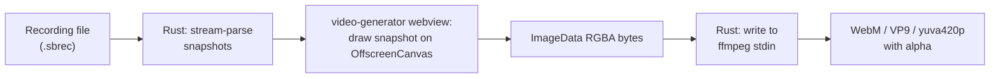

# 06 — Feature: Match Recording & Video Generation `[OPTIONAL]`

Two related but independently shippable features. Recording is cheap and low-risk. Video
generation is the most complex part of the whole application — schedule it last.

---

# Part A — Match Recording

## A1. What it does

While recording, the full match state is captured once per second and written to disk.
The resulting file can be replayed later to produce a video (Part B) or analysed.

## A2. File format `[NEW]`

The Electron implementation keeps the entire recording in memory and **rewrites the whole
JSON file every 5 seconds**. For a 90-minute match that is ~5 400 snapshots rewritten
1 080 times — O(n²) I/O, and a crash mid-write corrupts the file.

Replace it with a line-delimited format: `.sbrec` = a JSON header line followed by one
JSON snapshot per line, appended with an open `BufWriter` and flushed every second.

```
{"version":2,"recordingId":"<uuid>","startedAt":"2026-08-14T12:30:45Z","homeName":"HOME","awayName":"AWAY"}
{"t":0,"hs":0,"as":0,"tm":900,"hf":1,"hn":"HOME","an":"AWAY","hc":"#00ff00","ac":"#ff0000","hp":"PERIODO"}
{"t":1,"hs":0,"as":0,"tm":899,"hf":1, ...}
```

Properties: append-only, crash-safe (you lose at most the last second), constant memory,
streamable during generation.

A trailer line is appended on stop:

```
{"endedAt":"2026-08-14T14:05:12Z","totalSnapshots":5427}
```

A missing trailer means the recording was interrupted; the reader tolerates it and derives
the count by counting lines. `[NEW]`

**Keep a v1 importer** so existing `.json` recordings from the Electron app still work:
detect a leading `{` followed by `"version": "1.0"` and parse the legacy shape.

### A2.1 Snapshot fields

| Short       | Meaning                                     |
| ----------- | ------------------------------------------- |
| `t`         | relative seconds since start, starting at 0 |
| `hs` / `as` | home / away score                           |
| `tm`        | timer seconds                               |
| `hf`        | half                                        |
| `hn` / `an` | home / away name                            |
| `hc` / `ac` | home / away colour                          |
| `hp`        | half prefix                                 |

Names/colours/prefix repeat on every line. That is ~120 bytes/second, ~650 KB for a
90-minute match — irrelevant, and it makes every line independently renderable.

## A3. Storage location

`settings.recordingOutputDir`, defaulting to `document_dir()/ScoreboardRecordings`,
created recursively on first use. `[PARITY]`

Filename `[PARITY]`:

```
<sanitizedHome>-<sanitizedAway>-<ISO timestamp, no ms, ':' → '-'>.sbrec
```

Sanitizer: replace every char not in `[a-zA-Z0-9-_]` with `_`, collapse repeated
underscores, trim leading/trailing underscores.

## A4. Commands & events

| Command                       | Args | Returns                        |
| ----------------------------- | ---- | ------------------------------ |
| `recording_start`             | —    | `RecordingStatus`              |
| `recording_stop`              | —    | `{ filePath, totalSnapshots }` |
| `recording_status`            | —    | `RecordingStatus`              |
| `recording_get_output_dir`    | —    | `String`                       |
| `recording_select_output_dir` | —    | `Option<String>` (dialog)      |

```rust
#[derive(Serialize, Clone, TS)]
#[serde(rename_all = "camelCase")]
pub struct RecordingStatus {
    pub is_recording: bool,
    pub recording_id: Option<String>,
    pub file_path: Option<String>,
    pub snapshot_count: u64,
    pub duration_secs: u64,
}
```

Event `recording:status` is emitted to all windows on start, stop and every snapshot.

Team names come from the current state, defaulting to `HOME` / `AWAY`. `[PARITY]`

## A5. Implementation

A single tokio task with a 1 s interval:

```rust
loop {
    ticker.tick().await;
    let s = shared.scoreboard.read().await.clone();
    writeln!(writer, "{}", serde_json::to_string(&Snapshot::from(&s, relative))?)?;
    writer.flush()?;              // one 120-byte write per second; negligible
    relative += 1;
    shared.publish_recording_status();
}
```

`[PARITY]` The first snapshot is written one second after start with `t = 0`, matching the
Electron behaviour. `[RISK]` If you change this, existing generated videos shift by a
second.

`recording_stop` is idempotent-safe: return an error string `"No active recording"` when
idle. Starting while already recording returns `"Recording already in progress"`.

On app exit with an active recording, flush and write the trailer in the
`RunEvent::ExitRequested` handler. `[NEW]`

## A6. UI `[PARITY]`

**`RecordingControls` card**

- Output directory display + `Change` (disabled while recording)
- Start/Stop button, showing `Starting...` / `Stopping...` while the call is in flight
- Header shows a pulsing red dot and `REC MM:SS` while recording
- `Generate Video from Recording` opens the video generator (disabled while recording)

**Compact variant** (overlay control strip): status text + `Start Rec` / destructive
`Stop Rec`.

---

# Part B — Video Generation

## B1. Pipeline

Chosen approach: **offscreen canvas in the webview → raw frames to Rust → ffmpeg sidecar**.



`[NEW]` vs Electron: no offscreen `BrowserWindow`, no `capturePage()`, no PNG encode/write
of thousands of temp files, no temp directory at all. Frames stream straight into ffmpeg's
stdin as `rawvideo`. Expect roughly an order of magnitude speed-up and zero disk churn.

### B1.1 Why canvas and not the DOM

The scoreboard is a skewed DOM composition; there is no way to rasterize it from a webview
without a screenshot API, and Tauri has none. So the scoreboard must be **re-drawn in
Canvas2D**.

That is a real cost: `renderScoreboardToCanvas(ctx, snapshot, scale)` duplicates the
visual spec from doc 04 §6. Mitigate it:

- Keep the geometry constants (`600×80`, `w-28` = 112 px, `w-2` = 8 px, `w-16` = 64 px,
  skew −15°, colours `#ffffff` / `#1e1b4b` / `#64748b`) in **one shared module** imported
  by both the React component and the canvas renderer.
- Add a visual regression test: render the same snapshot through both paths and compare.
- Skew is `ctx.transform(1, 0, Math.tan(-15 * Math.PI / 180), 1, 0, 0)`.
- Fonts must be loaded before the first draw: `await document.fonts.load('40px Anton')`
  and `await document.fonts.ready`. `[RISK]` Skipping this produces the first N frames in
  a fallback font.

## B2. Configuration

```rust
#[derive(Deserialize, TS)]
#[serde(rename_all = "camelCase")]
pub struct VideoGenerationConfig {
    pub recording_path: String,
    pub output_path: String,       // must end in .webm
    pub frame_rate: u32,           // 1..=60, default 30
    pub scoreboard_scale: f32,     // 0.5..=3.0, default 1.0
}
```

Output dimensions: `round(600 × scale) × round(80 × scale)`. `[RISK]` VP9 wants even
dimensions — round each to the nearest even number.

## B3. ffmpeg invocation

Sidecar binary bundled as `src-tauri/binaries/ffmpeg-<target-triple>[.exe]`.

```
ffmpeg -y
  -f rawvideo -pix_fmt rgba -s <W>x<H> -r 1 -i pipe:0
  -r <frameRate>
  -c:v libvpx-vp9 -pix_fmt yuva420p -auto-alt-ref 0 -b:v 2M
  -progress pipe:1 -nostats
  <outputPath>
```

- Input rate 1 fps (one frame per recording second); output rate `frameRate`; ffmpeg
  duplicates frames. `[PARITY]` — identical to the current behaviour.
- `yuva420p` + `-auto-alt-ref 0` preserve the alpha channel. Both are mandatory; dropping
  `-auto-alt-ref 0` silently kills transparency in VP9.
- `-progress pipe:1` gives machine-readable progress (`frame=`, `fps=`, `out_time_ms=`)
  instead of parsing the human-readable stderr.

```rust
let (mut rx, mut child) = app.shell()
    .sidecar("ffmpeg")?
    .args(args)
    .spawn()?;
child.write(&frame_bytes)?;      // per frame
// ...
drop(child_stdin);               // closing stdin ends the encode
```

`[RISK]` `tauri-plugin-shell`'s `CommandChild::write` writes to stdin; make sure the
sidecar is spawned with piped stdin. If the plugin's API proves awkward for high-volume
binary stdin, fall back to `std::process::Command` with `Stdio::piped()` and resolve the
sidecar path yourself via `app.path().resolve("ffmpeg", BaseDirectory::Resource)`. This is
a legitimate and simpler option — the shell plugin's value here is only path resolution.

## B4. Frame transport (webview → Rust)

Per frame:

```ts
const bytes = new Uint8Array(ctx.getImageData(0, 0, W, H).data.buffer);
await invoke("video_push_frame", { index: i, frame: bytes });
```

Tauri v2 serializes `Vec<u8>` command arguments over the raw IPC channel efficiently, but
a 600×80 RGBA frame is 192 KB and a 90-minute match is 5 400 frames ≈ 1 GB of traffic.
Mitigations, in order of preference:

1. **Batch**: send 30 frames per invoke (≈ 5.6 MB) and keep a bounded queue of 2 batches
   in flight. `[NEW]`
2. Downscale nothing; do not re-encode to PNG — CPU cost outweighs the transfer.
3. If throughput is still a problem, invert the flow: Rust serves the frames over a
   loopback WebSocket to the generator window, which streams binary frames back. Keep this
   as plan B.

Backpressure: `video_push_frame` must `await` the write into ffmpeg's stdin so the webview
naturally throttles.

## B5. Progress model `[PARITY]`

```rust
#[derive(Serialize, Clone, TS)]
#[serde(rename_all = "camelCase")]
pub struct GenerationProgress {
    pub step: GenerationStep,   // idle|parsing|rendering|encoding|cleanup|complete|error
    pub step_progress: u8,      // 0..100
    pub overall_progress: u8,   // 0..100
    pub current_frame: Option<u64>,
    pub total_frames: Option<u64>,
    pub message: String,
    pub error: Option<String>,
}
```

Overall progress bands `[PARITY]`: parsing 0–5 %, rendering 10–60 %, encoding 60–95 %,
cleanup → 95 %, complete → 100 %. With streaming, rendering and encoding overlap; report
the combined phase as `rendering` until the last frame is pushed, then `encoding` while
ffmpeg drains.

Emitted on `video:progress` to the `video-generator` window, throttled to ~10 Hz.

## B6. Cancellation `[PARITY]`

An `AtomicBool` checked before every batch. On cancel: stop pushing, close stdin, kill the
child, delete the partial output file, emit `{ step: "error", error: "Generation cancelled" }`.

## B7. UI `[PARITY]`

Two-column card layout in the `video-generator` window (900×700).

**Recording File card** — read-only path + `Browse`, error box on load failure, loaded
metadata (teams, snapshot count, started, ended), and a read-only preview of the parsed
header/first snapshots.

**Video Settings card** — output file display + `Browse`; frame-rate slider **and**
numeric input, both clamped 1–60; progress section with a status label, percentage bar,
message, optional frame counter, and error/success state; `Generate Video` /
`Generate Again`, `Reset`, and a destructive `Cancel` while generating.

The scale control is commented out in the Electron UI. `[NEW]` Enable it as a select with
0.5× / 1× / 2× / 3× — the backend already supports it.

## B8. Acceptance criteria

- A 10-minute recording generates a WebM whose duration equals the snapshot count in
  seconds (±1 frame).
- Opening the output in OBS shows a transparent background, not black.
- Cancelling halfway leaves no partial file and no orphaned ffmpeg process.
- Generating twice in a row without restarting the app works.
- A v1 `.json` recording from the Electron app imports and generates correctly.
- Peak memory stays flat regardless of recording length (proves the streaming works).
