# 08 — Implementation Plan

Ordering principle: **build the spine first** (Rust state + timer + IPC), then the desktop
UI, then the network surface, then the optional features. Every phase ends with something
runnable and testable — never a phase whose only output is "code that doesn't run yet".

Sizes are relative complexity, not schedule: **S** small, **M** medium, **L** large.

```mermaid
graph LR
    P0["P0 Scaffold"] --> P1["P1 Core domain<br/>+ timer"]
    P1 --> P2["P2 Desktop UI"]
    P2 --> P3["P3 HTTP + WS<br/>+ OBS page"]
    P3 --> P4["P4 LAN remote<br/>+ token"]
    P4 --> P5["P5 Settings<br/>+ buzzer"]
    P5 --> P6["P6 Packaging<br/>v1.0 SHIPPABLE"]
    P6 -.optional.-> P7["P7 Overlay<br/>+ hotkeys"]
    P7 -.optional.-> P8["P8 Recording"]
    P8 -.optional.-> P9["P9 Video generation"]
```

**The release gate is at the end of P6.** Everything after it is additive.

---

## Phase 0 — Scaffold `S`

**Goal:** an empty Tauri app that builds and runs on Windows and Linux.

- `pnpm create tauri-app` → React + TypeScript + Vite, or scaffold manually per doc 01 §2.
- Add Tailwind 4 via `@tailwindcss/vite`; port `global.css`, `scoreboard.css`, fonts,
  `lib/utils.ts` and the whole `components/ui/` folder from the Electron repo.
- Configure the multi-entry Vite build (doc 04 §2) with placeholder HTML files.
- Set up ESLint + Prettier (port the existing configs), `cargo fmt`, `clippy -D warnings`.
- Wire `ts-rs` and the `pnpm bindings` script; commit `src/bindings/`.
- Set up the CI `check` job.

**Done when:** `pnpm dev` opens a window rendering a shadcn `Button` with correct fonts;
`pnpm check` is green in CI on both OSes.

---

## Phase 1 — Core domain & timer `M`

**Goal:** the authoritative state and a provably accurate timer, driven from a throwaway UI.

- `state.rs`: `ScoreboardState`, `ScoreboardPatch`, `Action`, `AppState`, `dispatch`,
  `publish`, validation (doc 03 §2).
- `timer.rs`: `TimerEngine` with the monotonic algorithm (doc 03 §3).
- Commands `sb_get_state`, `sb_dispatch`; events `state:changed`, `timer:finished`.
- Frontend: `TauriTransport`, `scoreboardStore`, and a bare debug page with buttons for
  every action.
- Rust unit tests: every `Action`, all validation rules, and the four timer tests from
  doc 03 §3.5.

**Done when:**

- Every action mutates state correctly and the debug UI reflects it instantly.
- A 10-minute countdown ends within 1 s of a stopwatch.
- Pause/resume 50 times and the total elapsed time is still exact.
- Changing the system clock mid-countdown does not affect the timer.

**`[RISK]` to watch:** the lock-then-emit deadlock (doc 03 §2.2). Get this right now, not
later.

---

## Phase 2 — Control window, menu bar & window manager `L`

**Goal:** the main window at full parity for match operation — and nothing else in it.

- `Layout`: single-column controls + status bar (doc 04 §7.1). No two-column split, no
  settings card, no preview.
- `ScoreboardControl`: team controls, half control, timer region, loadouts, reset
  (doc 04 §7.2).
- The visual `<Scoreboard/>` component, ported verbatim (doc 04 §6) — built now because
  P3 needs it, even though it is not shown in the main window.
- `menu.rs`: the full menu tree with accelerators and `on_menu_event` routing
  (doc 03 §7ter), attached with `main_window.set_menu`.
- `windows.rs`: singleton `open`/`close`/`list_open`, geometry persistence, monitor
  clamping, Esc-to-close (doc 03 §7bis) + the `window_*` commands and `windowStore`.
- `StatusBar` with the badges that already have data (timer state); the server, client,
  overlay and REC badges are wired as the corresponding phases land.
- `useLocalHotkeys` for window-focused shortcuts, with defaults from doc 05 §5.1.
- Empty `settings.html` and `outputs.html` shells that open from the menu, so the window
  plumbing is proven before the content exists.

**Done when:**

- A full match can be operated from the main window alone, with no scrolling at 640×480.
- The scoreboard renders pixel-identical to a reference screenshot from the Electron build
  at 600×80 (verified on the `/scoreboard` page or a scratch route).
- Every menu entry opens exactly one window; invoking it again focuses the existing one.
- Window positions and sizes survive a restart.
- Typing in a text field does not trigger hotkeys.

---

## Phase 3 — HTTP server & OBS page `L` ✅ **IMPLEMENTED**

**Goal:** OBS can consume the scoreboard over the LAN.

- `server/mod.rs` with axum, CORS, port fallback binding.
- REST routes: `/health`, `/api/scoreboard` (GET/POST), `/api/scoreboard/:property`,
  `/api/action`.
- WebSocket at `/ws`: initial state, broadcast fanout, lag recovery, heartbeat, rate limit,
  connection counting.
- `rust-embed` static serving of `dist/`.
- `scoreboard.html` entry with `WsTransport`, transparent background, font preloading.
- `/value/:property` page.
- `net.rs` LAN address enumeration + `ServerInfo` + `server_get_status`.
- **Outputs & Sharing window** (doc 04 §7.5): preview iframe, local URL, OBS instructions.
- Status bar: server and client badges go live.

**Done when:**

- OBS Browser Source at `http://<lan-ip>:3001/scoreboard` shows a transparent, live
  scoreboard.
- Changing the score in the app updates OBS within ~50 ms.
- Killing and restarting the app reconnects the browser source automatically.
- `curl -X POST /api/scoreboard -d '{"teamHomeScore":3}'` updates every client.
- Starting the app while port 3001 is occupied still works, on the fallback port, and the
  UI shows the real port.
- An unknown field in a POST returns 400 with a useful message.

**Implementation notes (decisions taken during P3):**

- **Auth is deferred to Phase 4, as planned.** `POST` routes and WS commands are open for
  now; the WS handler accepts (and ignores) a `?t=` query param so the protocol does not
  change when the token lands. `ServerInfo` therefore omits `controlUrl` / `controlQrSvg` /
  `tokenRequired` until P4 — the Outputs window renders a "Remote control arrives in
  Phase 4" placeholder card.
- **`ServerStatus.authorizedClients` is omitted** until P4 (no auth → the counter would
  always be 0). The struct carries `overlayActive` / `recordingActive` / `recordingSeconds`
  as `false`/`0` placeholders so the status-bar shape is stable for P7/P8.
- **WS close-code flush:** tungstenite drops the queued close frame if the socket is torn
  down immediately after a policy violation, so the client saw `1006` instead of `1008`.
  The handler now `sink.close()`es and waits 50 ms before breaking the loop — verified
  `1003` on a bad frame and `1008` on rate-limit via `scripts/ws-smoke.mjs`.
- **WS envelope:** `Action` is internally tagged, so it cannot be flattened into the
  externally tagged `{type:"command"}` envelope; the handler captures the raw value and
  deserializes the `Action` in a second step.
- **`dist/.gitkeep` is committed** (`.gitignore` ignores `dist/*` but not the placeholder)
  so a bare `cargo check` works on a clean checkout (doc 03 §4.3).
- **`examples/serve.rs`** starts the real axum stack without the Tauri shell — used to
  smoke-test REST/WS/pages with curl + Node. `scripts/ws-smoke.mjs` and
  `scripts/ws-timer-smoke.mjs` are the smoke harnesses (lint-excluded).
- Verified on Linux: all REST routes, page bootstrap injection, static assets, `/`
  redirect, 404s, port fallback 3001→3002, WS initial-state/fanout/ping/rate-limit, and
  live timer ticks + `timer-finished` over WS. **Windows manual verification still
  pending** (cross-cutting DoD).

---

## Phase 4 — LAN remote & access control `M` ✅ **IMPLEMENTED**

**Goal:** the phone remote, protected by a token.

- `auth.rs`: token generation, constant-time check, cookie issuance, read-only downgrade
  for unauthenticated sockets.
- `control.html` entry: the full React remote (doc 04 §8) using `WsTransport`.
- QR code generation in Rust; the Outputs window's LAN section with the eye toggle, QR,
  copy link, regenerate token.
- Read-only banner when unauthorized.
- Status bar: control-token badge goes live.

**Implementation notes (decisions taken during P4):**

- The token requirement is always enabled in this phase; the persisted
  `requireControlToken` toggle remains part of Phase 5 settings.
- `/control?t=...` exchanges the query token for an `HttpOnly`, `SameSite=Strict` cookie
  and redirects to `/control`, removing the secret from the address bar.
- WebSockets receive an explicit `authorization` frame after initial state. Token
  regeneration revokes existing write access immediately and pushes a read-only state to
  connected remotes without disrupting public scoreboard clients.
- The QR SVG is generated locally in Rust; no URL or token is sent to a third-party QR
  service.
- `scoreboard-store.ts` is transport-only, while the Tauri-backed singleton lives in
  `desktop-scoreboard-store.ts`; this keeps all browser-served entry dependency graphs free
  of `@tauri-apps/*` imports.
- Verified on Linux with the full `pnpm check` gate, including real WebSocket integration
  coverage for anonymous read-only access, authenticated writes, cookies, token rotation,
  REST authorization, and generated bindings. Phone/Windows manual verification remains
  pending under the cross-cutting definition of done.

**Done when:**

- Scanning the QR from a phone opens a working remote; every control matches the desktop.
- Opening `/control` without a token shows the "ask the operator" page.
- A second browser opened on `/scoreboard` still works with no token.
- Two phones plus the desktop plus OBS stay in sync.
- Focused text inputs on the phone are not overwritten by incoming state.
- Rate limiting kicks in under a button-mashing script and the socket recovers.

---

## Phase 5 — Settings window, persistence & buzzer `M` ✅ **IMPLEMENTED**

**Goal:** the app remembers everything and makes noise at the right time.

- `settings.rs`: atomic save, corrupt-file recovery, debounced writes, migration hook.
- Seed `ScoreboardState` from settings at startup.
- Settings commands + `settings:changed` event + `settingsStore`.
- **Settings window** (doc 04 §7.4): Scoreboard tab (names, colours, prefix, loadout
  `MM:SS` inputs with their validation) and Server tab (port + restart, token toggle).
- Buzzer tab: default asset, custom-track selection via dialog, asset-protocol playback,
  auto-play toggle, `Test` button, remote `BuzzerPlay` action routed to the main window.

**Implementation notes (decisions taken during P5):**

- **Settings live in `AppState`** alongside the scoreboard; `settings_set` is the single
  mutation path, mirroring `dispatch` for the scoreboard. Identity fields (names,
  colours, prefix, loadouts) are projected onto the live `ScoreboardState` immediately,
  so the main window and OBS update with no Save button.
- **Remote identity edits are persisted too**: an `Action::Patch` touching identity fields
  over LAN syncs those values back into `settings.json` (debounced), so a phone edit
  survives a restart just like a Settings-window edit.
- **Debounced atomic saves**: a serial counter coalesces rapid edits (typing) into one
  write 500 ms after the last keystroke; the write itself is tmp + fsync + rename.
- **Port changes restart the server in place**: the axum serve task handle is stored in
  `AppState`; a new `server_port` aborts it, marks the server down (status bar shows it),
  rebinds with the usual fallback ladder, and republishes `server:info`/`server:status`.
  LAN clients reconnect on their existing backoff.
- **`require_control_token` toggle is live**: `auth::check` reads the setting, so turning
  it off opens `/control`, POST routes, and WS writes immediately without a restart. The
  QR code is omitted from `ServerInfo` while the policy is off (there is no secret to
  encode), and the Outputs window shows an "open to the LAN" warning.
- **Pinned token support exists in the schema** (`pinned_control_token`) but no UI in this
  phase — the regenerate-every-launch default stands (doc 08 open question 2).
- **Default buzzer is compiled in** (`include_bytes!` from `src-tauri/assets/buzzer.mp3`),
  so `GET /buzzer.mp3` works even before the web bundle exists and the phone remote can
  always play it. A custom track is served from disk at the same route (MIME-sniffed,
  `no-store`); the desktop plays custom tracks through the asset protocol
  (`convertFileSrc`) and the default through the local server URL.
- **Desktop auto-play** lives in the main window: `timer:finished` plays when
  `buzzerAutoPlay` is on; `buzzer:play` (manual desktop or remote press) always plays.
  The phone keeps its own local auto toggle (doc 03 §3.4: clients decide for themselves).
- **Loadout inputs** accept `15:00`, `900`, `2:5`; reject `1:75`; revert on invalid blur
  (the shared `DraftInput` used by the remote, so focused-field protection matches).

**Done when:**

- Team names, colours, prefix, loadouts, port, buzzer choice and auto-play all survive a
  restart.
- Loadout inputs accept `15:00`, `900`, `2:5`; reject `1:75`; revert on invalid blur.
- Editing a team name in the Settings window updates the main window and OBS live, with no
  Save button.
- The timer hitting 00:00 plays the buzzer on the desktop and on any phone with auto on.
- Deleting `settings.json` yields defaults; corrupting it yields defaults plus a
  `.corrupt-*.json` backup and a warning in the log.
- The buzzer file is playable after a restart without re-selection.

---

## Phase 6 — Packaging & v1.0 release gate `M` ✅ **IMPLEMENTED**

**Goal:** installable, documented, shippable.

- Icons, product metadata, CSP hardening, capability files reviewed for least privilege.
- NSIS/MSI + AppImage/deb builds via `tauri-action`.
- First-run firewall explainer.
- README rewrite: install, OBS setup, remote setup, troubleshooting.
- Manual release checklist from doc 07 §9.

**Implementation notes (decisions taken during P6):**

- **Icons** are generated from the committed 1024×1024 source
  (`src-tauri/icons/source.png`) via `tauri icon`; the full desktop set
  (32/64/128/256/512 PNG, ICO, ICNS, Square logos) is committed. iOS/Android
  icon folders were discarded — desktop only.
- **Version is 1.0.0** in `tauri.conf.json`, `package.json` and `Cargo.toml`
  (real description/authors replace the template values).
- **CSP is now strict** (`default-src 'self'`). Two additions over the doc 07
  §3 sketch, discovered while auditing actual webview traffic:
  `media-src … http://localhost:*` (the built-in buzzer is played from the
  embedded server URL) and `frame-src http://localhost:*` (the Outputs window
  preview iframe loads `/scoreboard` from the embedded server).
- **`assetProtocol.scope` is now empty.** The custom buzzer track only worked
  before because the scope was `"**"`; the picked file is now granted at
  runtime in `buzzer_select_track` and re-granted at startup from the
  persisted setting, exactly as doc 07 §3 planned.
- **First-run firewall explainer**: a Windows-only info dialog shown once
  (`settings.firewall_notice_shown` persists the acknowledgement; new schema
  field, bindings regenerated). It explains the *Private networks* choice; the
  app never modifies firewall rules itself (doc 07 §4.1).
- **Bundle config**: targets `["nsis", "msi", "appimage", "deb"]`, NSIS
  per-machine, WebView2 `embedBootstrapper` (offline-friendly for venues with
  unreliable Wi-Fi), deb depends on `libwebkit2gtk-4.1-0` + `libgtk-3-0`.
- **CI `bundle` job** (`.github/workflows/build.yml`): `tauri-action` on
  `vX.Y.Z` tags or manual dispatch, gated on the `check` job, Windows +
  ubuntu-22.04 matrix, draft GitHub Release.
- **README rewritten**: install (SmartScreen path documented since installers
  are unsigned), quick start, OBS setup, phone remote, HTTP API table,
  settings location, release process, troubleshooting.
- **Capabilities reviewed**: `default.json` stays as-is — already least
  privilege for v1 (window/drag/zoom/dialog/opener only). Overlay windows get
  their own capability file in P7.

**Remaining before tagging v1.0.0:** the manual release checklist (doc 07 §9)
on clean Windows and Ubuntu VMs — the CI gates are green, but the VM
end-to-end run is by definition manual.

**Done when:** a clean Windows VM and a clean Ubuntu VM both install the artifact and run
a full match end-to-end with OBS and a phone, with no developer tools present.

> **This is the shippable v1.** Everything below is optional and can be released as 1.1,
> 1.2, 1.3.

---

## Phase 7 — Overlay mode & global hotkeys `[OPTIONAL]` `M`

Per doc 05.

- Overlay window builders with DPI-correct positioning, reusing `windows.rs`.
- `overlay-preview.html` and `overlay-control.html` entries.
- `Tools › Overlay Mode` checkable menu item + status-bar overlay badge, both synced from
  `overlay:opened` / `overlay:closed`.
- `tauri-plugin-global-shortcut` integration, key-code conversion with unit tests,
  press-only filtering, failure reporting.
- Hotkey settings tab (in the Settings window) with the recorder and duplicate detection.
- Overlay capability file.
- Wayland detection notice.

**Done when:** the acceptance criteria in doc 05 §9 all pass, including a running timer
surviving overlay enable/disable — the behaviour the Electron app could not deliver.

---

## Phase 8 — Match recording `[OPTIONAL]` `S` ✅ **IMPLEMENTED**

Per doc 06 Part A.

- `.sbrec` writer task, v1 JSON importer, output-directory setting, status events.
- The **recording window** (doc 06 §A6) opened from `Tools › Recording…`, plus the compact
  overlay strip and the REC badge in the main status bar.
- Flush-on-exit handling.

**Implementation notes (decisions taken during P8):**

- **`recording.rs`** owns the `.sbrec` writer (header line + one snapshot line/second +
  trailer), the v1 Electron `.json` importer (`read_recording`, auto-detected by a leading
  `"version": 2` line), the filename sanitizer (with an all-invalid-input `team` fallback
  the Electron app lacked) and the recents scanner. The session lives in
  `AppState.recording` behind a std `Mutex` that is never held across an `.await` (same
  discipline as `control_token`); `ServerStatus.recording_active` / `recording_seconds`
  read it directly, and the elapsed seconds come from a monotonic `tokio::time::Instant`
  so no new atomic is needed.
- **Tick anchor**: the 1 s ticker is `interval_at(started + 1 s, 1 s)` with
  `MissedTickBehavior::Burst`. Anchoring at the task's first poll (or using `Delay`) drops
  boundary-missed ticks, producing `line count < duration` — caught by the paused-time
  tests; `Burst` backfills missed seconds so the P8 line-count acceptance holds even under
  scheduler stalls. The first snapshot still lands at +1 s with `t = 0` [PARITY].
- **Write failures stop cleanly**: a disk-full/unplugged-drive write error makes the tick
  task finalize the file and stop rather than lose the whole match silently.
- **`recording:status` is emitted via `emit_app`** (to webviews only) and is deliberately
  **not** a `ServerEvent`: recording control is desktop-only, so the LAN WS surface is
  unchanged.
- **Feature gate**: `default = ["recording"]` in `Cargo.toml` — `pnpm dev` /
  `pnpm build` compile it in (CI matrix unchanged), and `cargo build --no-default-features`
  proves the feature-free build stays green (doc 06 §B8). `windows::open` rejects
  compiled-out windows via `AppWindow::enabled()`, and the Tools menu entry was already
  `cfg`-gated. Commands are compiled unconditionally (they are unreachable when the UI is
  gated) so CI still type-checks them.
- **Exit flush**: the builder was restructured from `…run(…)` to `build()` + `app.run()`
  so `RunEvent::ExitRequested` writes the trailer and fsyncs synchronously (the tokio
  runtime is already tearing down — no async there). A verified pre-existing Windows hang
  when the window is closed during runtime startup (~4 s) is **not** from this change —
  it reproduces identically on HEAD.
- **Settings**: `recording_output_dir` (nullable; `None` = `document_dir()/ScoreboardRecordings`,
  with a home/temp fallback for headless sessions). The recording window's `Change…`
  button persists it through the same `settings_set` path as everything else.
- **Compact overlay strip is deferred**: the P7 overlay does not exist yet, so there is
  nothing to host the strip on. The REC badge in the main status bar (hidden when idle,
  pulsing red `● REC MM:SS`, click opens the window) covers the parity requirement.
- New deps: `uuid` (v4 recording ids, per the doc 03 dependency sketch) and `chrono`
  (ISO-8601 header/trailer stamps) — both were already in the lock tree transitively.

**Done when:** a 20-minute recording produces a file whose line count equals the duration
in seconds; killing the process mid-recording leaves a readable file missing at most one
line; closing the recording window does not stop the recording.

---

## Phase 9 — Video generation `[OPTIONAL]` `L` ✅ **IMPLEMENTED**

Per doc 06 Part B.

**Implementation notes (decisions taken during P9):**

- **ffmpeg distribution (open question 4, resolved)**: bundled sidecar +
  `PATH` fallback. `scripts/fetch-ffmpeg.mjs` downloads a static libvpx build
  (gyan.dev on Windows, johnvansickle on Linux) into the git-ignored
  `src-tauri/binaries/` at release time; the CI `bundle` job merges
  `externalBin` via the `TAURI_CONFIG` env var because a committed
  `externalBin` entry fails every build where the binary is absent. At
  runtime `video::resolve_ffmpeg` prefers the resource-dir sidecar and probes
  `ffmpeg -version` on `PATH` otherwise. ffmpeg is spawned with
  `std::process::Command` — doc 06 §B3's sanctioned fallback (piped
  stdin/stdout/stderr, no shell plugin).
- **`video` joined the default Cargo features**, like `recording`;
  `--no-default-features` still builds and gates menu/window (doc 06 §B8).
- **Frame size is 622×80 at scale 1, not 600×80** (doc 06 §B2 refined): the
  board is 600×80 but its −15° skew widens the bounding box by ~21.4 px; the
  OBS page already renders it as 600 centered in 622 (`pages/scoreboard.html`).
  Video frames do the same so the skewed corners are not clipped and the video
  matches the OBS source pixel-for-pixel. Dimensions are rounded to even for
  VP9 (e.g. 0.5× → 312×40, 1.5× → 934×120).
- **Frame transport**: one `Uint8Array` per 30-frame batch as the *sole*
  invoke argument — Tauri v2 then sends it as a raw
  `application/octet-stream` body (a typed array nested in a JSON args object
  is expanded into a JSON number array). Buffer layout:
  `[u32 LE start][u32 LE frame_count][RGBA frames…]`; `video_push_frames`
  takes the raw `tauri::ipc::Request`. The awaited pipe write into ffmpeg's
  stdin is the backpressure: one batch in flight, no frame accumulation, so
  memory stays flat for a 90-minute recording.
- **Canvas renderer** (`src/lib/renderScoreboardToCanvas.ts`) shares its
  geometry constants with the React component via
  `src/lib/scoreboardGeometry.ts` (doc 06 §B1.1). Text placement reproduces
  CSS line-box centering exactly — `baseline = center + (ascent − descent)/2`
  from `fontBoundingBox*` metrics with an alphabetic baseline (canvas
  `textBaseline: "middle"` is ~6 px off for Anton at 36 px); verified
  pixel-compared against the DOM component: all glyph ink centers within 0.8 px.
- **Encoder I/O**: ffmpeg's stdout (`-progress pipe:1`) is drained
  continuously (a full pipe would deadlock the encode), stderr kept as a
  bounded 8 KB tail for error messages, and the child is reaped with
  `try_wait` polling so `cancel` can always `kill` (never a blocking `wait`
  while holding the child mutex). Cancellation deletes the partial output and
  emits `{ step: "error", error: "Generation cancelled" }` [PARITY].
- **Alpha verification caveat**: ffprobe reports the VP9 base stream as
  `yuv420p` even when alpha is present (it rides in WebM `BlockAdditional`
  side-data, `alpha_mode: 1`), and ffmpeg's *native* vp9 decoder silently
  drops it. The e2e test therefore decodes with `-c:v libvpx-vp9` and asserts
  the decoded alpha channel (~128 from semi-transparent test frames).
- **Progress bands** exactly as doc 06 §B5 (parse 0–5, render 10–60, encode
  60–95 via ffmpeg `out_time`, cleanup 95, complete 100), throttled to ~10 Hz
  except step transitions; the last progress is kept in `AppState` so a
  freshly opened window seeds from `video_progress`.
- **UI** per §B7: two cards (Recording File with metadata + raw preview,
  Video Settings with frame-rate slider+number and the scale select — enabled
  as 0.5×/1×/2×/3×), progress bar with frame counter, Generate /
  Generate Again / Reset / destructive Cancel, Reveal-in-folder on success.
  The recording window's _Generate Video from Recording…_ hands the most
  recent recording over through `video_open_with_recording` →
  `video_take_pending_recording`.
- **Capability**: `dialog:allow-save` joined `default.json` (the output save
  dialog); the window already had `dialog:allow-open`.
- **No console window flash on Windows**: ffmpeg is spawned via a shared
  `ffmpeg_command` builder that sets `CREATE_NO_WINDOW` (0x08000000) — the
  installed build is `#![windows_subsystem = "windows"]`, so a plain
  `Command::new("ffmpeg")` would flash a cmd window on every generation and
  on the `-version` probe.
- **Tests**: 6 unit tests (validation, even rounding, ffmpeg args, metadata,
  batch validation) + `tests/video_generation.rs` integration: real end-to-end
  WebM encode with alpha assertion, cancel-kills-ffmpeg + partial cleanup,
  and generate-twice — auto-skipping when ffmpeg is absent.

**Remaining:** manual verification on Windows + Linux of the full
window-driven flow (record → generate → OBS), per the cross-cutting DoD.

**Done when:** the acceptance criteria in doc 06 §B8 all pass, notably flat memory usage
on a 90-minute recording.

---

## Cross-cutting definition of done

Every phase must satisfy all of:

- [ ] `cargo clippy -- -D warnings` clean
- [ ] `cargo test` green, including new tests for the phase's logic
- [ ] `tsc --noEmit` clean, ESLint clean
- [ ] `src/bindings/` regenerated and committed
- [ ] No `console.log` / `dbg!` / `println!` left behind (use `tracing`)
- [ ] Manually verified on **both** Windows and Linux
- [ ] Docs in this folder updated if the design changed

## Parity checklist (verify before declaring v1 complete)

| #   | Behaviour                                                         | Source  |
| --- | ----------------------------------------------------------------- | ------- |
| 1   | Scores never go below 0                                           | 02 §3.1 |
| 2   | Half never goes below 1                                           | 02 §3.1 |
| 3   | `Stop` zeroes the timer; `Pause` does not                         | 02 §3.1 |
| 4   | Reset preserves names, colours, prefix, loadouts                  | 02 §3.1 |
| 5   | Timer at 0 disables Start and Reset in the UI                     | 04 §7.2 |
| 6   | `/value/:property` formats `timer` as `MM:SS`, 404s on unknown    | 02 §5.1 |
| 7   | CORS is open for GET/POST                                         | 02 §5.2 |
| 8   | LAN addresses hidden behind the eye toggle by default             | 04 §7.5 |
| 9   | Remote text inputs are not overwritten while focused              | 04 §8   |
| 10  | Remote buttons are ≥ 48 px tall, inputs ≥ 44 px                   | 04 §8   |
| 11  | Scoreboard renders at exactly 600×80 with the documented geometry | 04 §6   |
| 12  | Default loadouts 900 / 2700 / 1200                                | 02 §2   |
| 13  | Default half prefix `PERIODO`                                     | 02 §2   |
| 14  | Default colours `#00ff00` / `#ff0000`                             | 02 §2   |
| 15  | Hotkeys ignored while typing in a field                           | 04 §9   |
| 16  | Recording snapshots start at `t = 0`, one per second              | 06 §A5  |
| 17  | Generated video preserves alpha                                   | 06 §B3  |
| 18  | Every feature window is a singleton and reopens where it was left | 03 §7bis |
| 19  | Overlay windows carry no menu bar                                 | 03 §7ter |

## Open questions to resolve during implementation

1. **Reset semantics for team identity** — the Electron `reset()` restores the _default_
   names and colours (HOME/AWAY, green/red), while the WS `reset` command only clears
   scores/half/timer. Doc 02 §3.1 standardizes on **preserving** identity. Confirm this is
   what you want before P2 ships; it is a visible behaviour change.
2. **Token lifetime** — regenerate every launch (safer) or pin once (more convenient for a
   bookmarked phone). Default is regenerate; the pinned option exists in settings.
3. **`eventLogo`** — dead in the Electron app. Either implement it (upload an image, serve
   it, render it on the left of the board) or delete the field from the schema. Decide
   before P3 freezes the API.
4. **ffmpeg distribution** — RESOLVED in P9: bundled sidecar (fetched at release time by
   `scripts/fetch-ffmpeg.mjs`, wired via `TAURI_CONFIG`-merged `externalBin`) with a
   `PATH` fallback in development.
