# 08 — Implementation Plan

Ordering principle: **build the spine first** (Rust state + timer + IPC), then the desktop
UI, then the network surface, then the optional features. Every phase ends with something
runnable and testable — never a phase whose only output is "code that doesn't run yet".

Sizes are relative complexity, not schedule: **S** small, **M** medium, **L** large.

```mermaid
graph LR
    P0["P0 Scaffold"] --> P1["P1 Core domain<br/>+ timer"]
    P1 --> P2["P2 Desktop UI"]
    P2 --> P3["P3 HTTP + WS<br/>+ OBS page"]
    P3 --> P4["P4 LAN remote<br/>+ token"]
    P4 --> P5["P5 Settings<br/>+ buzzer"]
    P5 --> P6["P6 Packaging<br/>v1.0 SHIPPABLE"]
    P6 -.optional.-> P7["P7 Overlay<br/>+ hotkeys"]
    P7 -.optional.-> P8["P8 Recording"]
    P8 -.optional.-> P9["P9 Video generation"]
```

**The release gate is at the end of P6.** Everything after it is additive.

---

## Phase 0 — Scaffold `S`

**Goal:** an empty Tauri app that builds and runs on Windows and Linux.

- `pnpm create tauri-app` → React + TypeScript + Vite, or scaffold manually per doc 01 §2.
- Add Tailwind 4 via `@tailwindcss/vite`; port `global.css`, `scoreboard.css`, fonts,
  `lib/utils.ts` and the whole `components/ui/` folder from the Electron repo.
- Configure the multi-entry Vite build (doc 04 §2) with placeholder HTML files.
- Set up ESLint + Prettier (port the existing configs), `cargo fmt`, `clippy -D warnings`.
- Wire `ts-rs` and the `pnpm bindings` script; commit `src/bindings/`.
- Set up the CI `check` job.

**Done when:** `pnpm dev` opens a window rendering a shadcn `Button` with correct fonts;
`pnpm check` is green in CI on both OSes.

---

## Phase 1 — Core domain & timer `M`

**Goal:** the authoritative state and a provably accurate timer, driven from a throwaway UI.

- `state.rs`: `ScoreboardState`, `ScoreboardPatch`, `Action`, `AppState`, `dispatch`,
  `publish`, validation (doc 03 §2).
- `timer.rs`: `TimerEngine` with the monotonic algorithm (doc 03 §3).
- Commands `sb_get_state`, `sb_dispatch`; events `state:changed`, `timer:finished`.
- Frontend: `TauriTransport`, `scoreboardStore`, and a bare debug page with buttons for
  every action.
- Rust unit tests: every `Action`, all validation rules, and the four timer tests from
  doc 03 §3.5.

**Done when:**

- Every action mutates state correctly and the debug UI reflects it instantly.
- A 10-minute countdown ends within 1 s of a stopwatch.
- Pause/resume 50 times and the total elapsed time is still exact.
- Changing the system clock mid-countdown does not affect the timer.

**`[RISK]` to watch:** the lock-then-emit deadlock (doc 03 §2.2). Get this right now, not
later.

---

## Phase 2 — Control window, menu bar & window manager `L`

**Goal:** the main window at full parity for match operation — and nothing else in it.

- `Layout`: single-column controls + status bar (doc 04 §7.1). No two-column split, no
  settings card, no preview.
- `ScoreboardControl`: team controls, half control, timer region, loadouts, reset
  (doc 04 §7.2).
- The visual `<Scoreboard/>` component, ported verbatim (doc 04 §6) — built now because
  P3 needs it, even though it is not shown in the main window.
- `menu.rs`: the full menu tree with accelerators and `on_menu_event` routing
  (doc 03 §7ter), attached with `main_window.set_menu`.
- `windows.rs`: singleton `open`/`close`/`list_open`, geometry persistence, monitor
  clamping, Esc-to-close (doc 03 §7bis) + the `window_*` commands and `windowStore`.
- `StatusBar` with the badges that already have data (timer state); the server, client,
  overlay and REC badges are wired as the corresponding phases land.
- `useLocalHotkeys` for window-focused shortcuts, with defaults from doc 05 §5.1.
- Empty `settings.html` and `outputs.html` shells that open from the menu, so the window
  plumbing is proven before the content exists.

**Done when:**

- A full match can be operated from the main window alone, with no scrolling at 640×480.
- The scoreboard renders pixel-identical to a reference screenshot from the Electron build
  at 600×80 (verified on the `/scoreboard` page or a scratch route).
- Every menu entry opens exactly one window; invoking it again focuses the existing one.
- Window positions and sizes survive a restart.
- Typing in a text field does not trigger hotkeys.

---

## Phase 3 — HTTP server & OBS page `L` ✅ **IMPLEMENTED**

**Goal:** OBS can consume the scoreboard over the LAN.

- `server/mod.rs` with axum, CORS, port fallback binding.
- REST routes: `/health`, `/api/scoreboard` (GET/POST), `/api/scoreboard/:property`,
  `/api/action`.
- WebSocket at `/ws`: initial state, broadcast fanout, lag recovery, heartbeat, rate limit,
  connection counting.
- `rust-embed` static serving of `dist/`.
- `scoreboard.html` entry with `WsTransport`, transparent background, font preloading.
- `/value/:property` page.
- `net.rs` LAN address enumeration + `ServerInfo` + `server_get_status`.
- **Outputs & Sharing window** (doc 04 §7.5): preview iframe, local URL, OBS instructions.
- Status bar: server and client badges go live.

**Done when:**

- OBS Browser Source at `http://<lan-ip>:3001/scoreboard` shows a transparent, live
  scoreboard.
- Changing the score in the app updates OBS within ~50 ms.
- Killing and restarting the app reconnects the browser source automatically.
- `curl -X POST /api/scoreboard -d '{"teamHomeScore":3}'` updates every client.
- Starting the app while port 3001 is occupied still works, on the fallback port, and the
  UI shows the real port.
- An unknown field in a POST returns 400 with a useful message.

**Implementation notes (decisions taken during P3):**

- **Auth is deferred to Phase 4, as planned.** `POST` routes and WS commands are open for
  now; the WS handler accepts (and ignores) a `?t=` query param so the protocol does not
  change when the token lands. `ServerInfo` therefore omits `controlUrl` / `controlQrSvg` /
  `tokenRequired` until P4 — the Outputs window renders a "Remote control arrives in
  Phase 4" placeholder card.
- **`ServerStatus.authorizedClients` is omitted** until P4 (no auth → the counter would
  always be 0). The struct carries `overlayActive` / `recordingActive` / `recordingSeconds`
  as `false`/`0` placeholders so the status-bar shape is stable for P7/P8.
- **WS close-code flush:** tungstenite drops the queued close frame if the socket is torn
  down immediately after a policy violation, so the client saw `1006` instead of `1008`.
  The handler now `sink.close()`es and waits 50 ms before breaking the loop — verified
  `1003` on a bad frame and `1008` on rate-limit via `scripts/ws-smoke.mjs`.
- **WS envelope:** `Action` is internally tagged, so it cannot be flattened into the
  externally tagged `{type:"command"}` envelope; the handler captures the raw value and
  deserializes the `Action` in a second step.
- **`dist/.gitkeep` is committed** (`.gitignore` ignores `dist/*` but not the placeholder)
  so a bare `cargo check` works on a clean checkout (doc 03 §4.3).
- **`examples/serve.rs`** starts the real axum stack without the Tauri shell — used to
  smoke-test REST/WS/pages with curl + Node. `scripts/ws-smoke.mjs` and
  `scripts/ws-timer-smoke.mjs` are the smoke harnesses (lint-excluded).
- Verified on Linux: all REST routes, page bootstrap injection, static assets, `/`
  redirect, 404s, port fallback 3001→3002, WS initial-state/fanout/ping/rate-limit, and
  live timer ticks + `timer-finished` over WS. **Windows manual verification still
  pending** (cross-cutting DoD).

---

## Phase 4 — LAN remote & access control `M`

**Goal:** the phone remote, protected by a token.

- `auth.rs`: token generation, constant-time check, cookie issuance, read-only downgrade
  for unauthenticated sockets.
- `control.html` entry: the full React remote (doc 04 §8) using `WsTransport`.
- QR code generation in Rust; the Outputs window's LAN section with the eye toggle, QR,
  copy link, regenerate token.
- Read-only banner when unauthorized.
- Status bar: control-token badge goes live.

**Done when:**

- Scanning the QR from a phone opens a working remote; every control matches the desktop.
- Opening `/control` without a token shows the "ask the operator" page.
- A second browser opened on `/scoreboard` still works with no token.
- Two phones plus the desktop plus OBS stay in sync.
- Focused text inputs on the phone are not overwritten by incoming state.
- Rate limiting kicks in under a button-mashing script and the socket recovers.

---

## Phase 5 — Settings window, persistence & buzzer `M`

**Goal:** the app remembers everything and makes noise at the right time.

- `settings.rs`: atomic save, corrupt-file recovery, debounced writes, migration hook.
- Seed `ScoreboardState` from settings at startup.
- Settings commands + `settings:changed` event + `settingsStore`.
- **Settings window** (doc 04 §7.4): Scoreboard tab (names, colours, prefix, loadout
  `MM:SS` inputs with their validation) and Server tab (port + restart, token toggle).
- Buzzer tab: default asset, custom-track selection via dialog, asset-protocol playback,
  auto-play toggle, `Test` button, remote `BuzzerPlay` action routed to the main window.

**Done when:**

- Team names, colours, prefix, loadouts, port, buzzer choice and auto-play all survive a
  restart.
- Loadout inputs accept `15:00`, `900`, `2:5`; reject `1:75`; revert on invalid blur.
- Editing a team name in the Settings window updates the main window and OBS live, with no
  Save button.
- The timer hitting 00:00 plays the buzzer on the desktop and on any phone with auto on.
- Deleting `settings.json` yields defaults; corrupting it yields defaults plus a
  `.corrupt-*.json` backup and a warning in the log.
- The buzzer file is playable after a restart without re-selection.

---

## Phase 6 — Packaging & v1.0 release gate `M`

**Goal:** installable, documented, shippable.

- Icons, product metadata, CSP hardening, capability files reviewed for least privilege.
- NSIS/MSI + AppImage/deb builds via `tauri-action`.
- First-run firewall explainer.
- README rewrite: install, OBS setup, remote setup, troubleshooting.
- Manual release checklist from doc 07 §9.

**Done when:** a clean Windows VM and a clean Ubuntu VM both install the artifact and run
a full match end-to-end with OBS and a phone, with no developer tools present.

> **This is the shippable v1.** Everything below is optional and can be released as 1.1,
> 1.2, 1.3.

---

## Phase 7 — Overlay mode & global hotkeys `[OPTIONAL]` `M`

Per doc 05.

- Overlay window builders with DPI-correct positioning, reusing `windows.rs`.
- `overlay-preview.html` and `overlay-control.html` entries.
- `Tools › Overlay Mode` checkable menu item + status-bar overlay badge, both synced from
  `overlay:opened` / `overlay:closed`.
- `tauri-plugin-global-shortcut` integration, key-code conversion with unit tests,
  press-only filtering, failure reporting.
- Hotkey settings tab (in the Settings window) with the recorder and duplicate detection.
- Overlay capability file.
- Wayland detection notice.

**Done when:** the acceptance criteria in doc 05 §9 all pass, including a running timer
surviving overlay enable/disable — the behaviour the Electron app could not deliver.

---

## Phase 8 — Match recording `[OPTIONAL]` `S`

Per doc 06 Part A.

- `.sbrec` writer task, v1 JSON importer, output-directory setting, status events.
- The **recording window** (doc 06 §A6) opened from `Tools › Recording…`, plus the compact
  overlay strip and the REC badge in the main status bar.
- Flush-on-exit handling.

**Done when:** a 20-minute recording produces a file whose line count equals the duration
in seconds; killing the process mid-recording leaves a readable file missing at most one
line; closing the recording window does not stop the recording.

---

## Phase 9 — Video generation `[OPTIONAL]` `L`

Per doc 06 Part B. **The riskiest phase — do it last, and spike it before committing.**

Suggested order:

1. **Spike:** hardcode 10 snapshots, draw them on a canvas, pipe raw frames to a manually
   invoked ffmpeg, confirm the WebM has alpha in OBS. Do not build any UI yet.
2. Shared geometry constants module + `renderScoreboardToCanvas` + a visual diff test
   against the React component.
3. ffmpeg sidecar bundling and path resolution on both platforms.
4. Streaming pipeline with batching and backpressure.
5. Progress reporting and cancellation.
6. The `video-generator` window UI, opened from `Tools › Video Generator…` and from the
   recording window.

**Done when:** the acceptance criteria in doc 06 §B8 all pass, notably flat memory usage
on a 90-minute recording.

---

## Cross-cutting definition of done

Every phase must satisfy all of:

- [ ] `cargo clippy -- -D warnings` clean
- [ ] `cargo test` green, including new tests for the phase's logic
- [ ] `tsc --noEmit` clean, ESLint clean
- [ ] `src/bindings/` regenerated and committed
- [ ] No `console.log` / `dbg!` / `println!` left behind (use `tracing`)
- [ ] Manually verified on **both** Windows and Linux
- [ ] Docs in this folder updated if the design changed

## Parity checklist (verify before declaring v1 complete)

| #   | Behaviour                                                         | Source  |
| --- | ----------------------------------------------------------------- | ------- |
| 1   | Scores never go below 0                                           | 02 §3.1 |
| 2   | Half never goes below 1                                           | 02 §3.1 |
| 3   | `Stop` zeroes the timer; `Pause` does not                         | 02 §3.1 |
| 4   | Reset preserves names, colours, prefix, loadouts                  | 02 §3.1 |
| 5   | Timer at 0 disables Start and Reset in the UI                     | 04 §7.2 |
| 6   | `/value/:property` formats `timer` as `MM:SS`, 404s on unknown    | 02 §5.1 |
| 7   | CORS is open for GET/POST                                         | 02 §5.2 |
| 8   | LAN addresses hidden behind the eye toggle by default             | 04 §7.5 |
| 9   | Remote text inputs are not overwritten while focused              | 04 §8   |
| 10  | Remote buttons are ≥ 48 px tall, inputs ≥ 44 px                   | 04 §8   |
| 11  | Scoreboard renders at exactly 600×80 with the documented geometry | 04 §6   |
| 12  | Default loadouts 900 / 2700 / 1200                                | 02 §2   |
| 13  | Default half prefix `PERIODO`                                     | 02 §2   |
| 14  | Default colours `#00ff00` / `#ff0000`                             | 02 §2   |
| 15  | Hotkeys ignored while typing in a field                           | 04 §9   |
| 16  | Recording snapshots start at `t = 0`, one per second              | 06 §A5  |
| 17  | Generated video preserves alpha                                   | 06 §B3  |
| 18  | Every feature window is a singleton and reopens where it was left | 03 §7bis |
| 19  | Overlay windows carry no menu bar                                 | 03 §7ter |

## Open questions to resolve during implementation

1. **Reset semantics for team identity** — the Electron `reset()` restores the _default_
   names and colours (HOME/AWAY, green/red), while the WS `reset` command only clears
   scores/half/timer. Doc 02 §3.1 standardizes on **preserving** identity. Confirm this is
   what you want before P2 ships; it is a visible behaviour change.
2. **Token lifetime** — regenerate every launch (safer) or pin once (more convenient for a
   bookmarked phone). Default is regenerate; the pinned option exists in settings.
3. **`eventLogo`** — dead in the Electron app. Either implement it (upload an image, serve
   it, render it on the left of the board) or delete the field from the schema. Decide
   before P3 freezes the API.
4. **ffmpeg distribution** — bundle a full build, bundle a minimal custom build, or make
   the video feature a separate download. Decide before P9.
